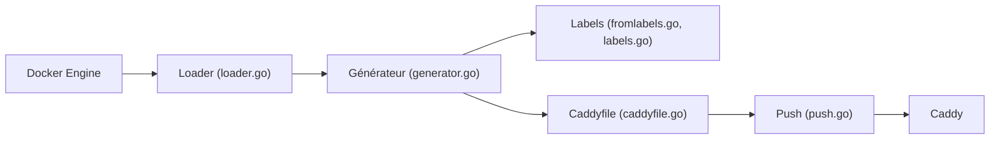

# lucaslorentz/caddy-docker-proxy

> Plugin Caddy qui configure un reverse proxy à partir des labels de conteneurs Docker, pour homelabs et petits clusters Swarm.

## Le problème
Maintenir à la main un Caddyfile à chaque ajout ou retrait de service Docker est fastidieux et source d'oublis.

## Ce que ça fait vraiment
Il lit les métadonnées Docker, repère les labels préfixés `caddy`, génère un Caddyfile en mémoire et déclenche un rechargement sans interruption à chaque changement. Les labels se traduisent en directives (`caddy.reverse_proxy: "{{upstreams 80}}"`), avec modèles Go. Il cible conteneurs ou services Swarm. Trois modes : standalone (par défaut), controller et server. HTTPS automatique via Let's Encrypt/ZeroSSL.

## Comment c'est branché


## Essayer
```bash
docker network create caddy --ipv6
docker compose up -d
docker run --name caddy -d -p 443:443 -v /var/run/docker.sock:/var/run/docker.sock lucaslorentz/caddy-docker-proxy:ci-alpine
```

## Coût et pièges
Gratuit. Accès au socket Docker pour le contrôleur (surface sensible). Volume `/data` persistant, sinon réémission de certificats et quotas Let's Encrypt. Images `ci` instables.

## Ce que ce n'est pas
Pas un orchestrateur ni un service mesh. La détection automatique du réseau d'ingress échoue parfois : fixe `CADDY_INGRESS_NETWORKS`.

## Alternatives
Non documenté dans le README : aucune alternative nommée.

## Pour toi
Pratique pour exposer proprement des services ML (Jupyter, MLflow, API) sur un serveur Docker unique avec HTTPS ; inutile si tu es déjà sur Kubernetes.

