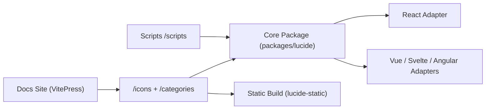

# lucide-icons/lucide

> Bibliothèque d'icônes SVG open source avec paquets par framework, pour designers et développeurs front.

## Le problème
Garder un jeu d'icônes cohérent et léger dans plusieurs frameworks front.

## Ce que ça fait vraiment
Publie plus de 1600 icônes vectorielles et des paquets npm dédiés : `lucide`, `lucide-react`, `@lucide/vue`, `@lucide/svelte`, `lucide-solid`, `lucide-preact`, `lucide-react-native`, `@lucide/angular`, `@lucide/astro`, `lucide-static`. Un plugin Figma existe. Le README refuse les logos de marques. D'après le code : monorepo pnpm, icônes en JSON, scripts de génération et site de docs VitePress.

## Comment c'est branché

## Essayer
Aucune commande d'installation dans le README fourni (les paquets npm sont listés, la doc est en ligne).

## Coût et pièges
Gratuit. La licence est présente mais non identifiée par GitHub : lire le fichier LICENSE avant usage commercial.

## Ce que ce n'est pas
Ce n'est pas un jeu d'icônes de marques. Ce n'est pas non plus une bibliothèque de composants UI.

## Alternatives
Aucune alternative nommée dans le README.

## Pour toi
Surveiller : utile pour habiller un dashboard ou une app d'IA (Streamlit non concerné, React oui), sans enjeu data ; vérifier la licence exacte.

