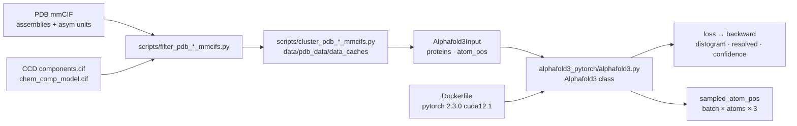

# lucidrains/alphafold3-pytorch

> **An open PyTorch reimplementation of the AlphaFold 3 architecture, to train yourself, with no weights shipped.**

## The problem

AlphaFold 3 is described in a *Nature* paper (Abramson et al., 2024) whose reference code does
not come with the publication in a freely reusable form. Anyone who wants to study the
architecture, modify one of its modules or train it on their own structures has to transcribe
the supplement's algorithms by hand, then rebuild the whole pipeline that goes from the PDB's
mmCIF files to the model's atomic inputs.

## What it actually does

The repository provides an `Alphafold3` class in PyTorch, instantiable with its dimensions and
the depth of each block (`pairformer_stack`, `msa_module_kwargs`, `template_embedder_kwargs`,
`diffusion_module_kwargs`, `confidence_head_kwargs`). A single call serves both regimes: with
`atom_pos` and the labels (`distance_labels`, `resolved_labels`) it returns a loss to call
`backward()` on; without them, with `num_sample_steps`, it samples atom positions shaped
`(batch, atom_seq_len, 3)`.

Two input levels coexist: the raw atomic level (`atom_inputs`, `atompair_inputs`,
`molecule_atom_lens`, `msa`, `templates`, which you build yourself) and a molecule level,
`Alphafold3Input`, which takes protein sequences directly (`proteins = ['AG']`) and is consumed
through `forward_with_alphafold3_inputs`.

The second half of the repository is data preparation: `filter_pdb_{train,val,test}_mmcifs.py`
and `cluster_pdb_{train,val,test}_mmcifs.py` scripts that filter then cluster PDB complexes,
plus downloads of the Chemical Component Dictionary and of distillation data. The README credits
contributors module by module (relative positional encoding, smooth LDDT loss, weighted rigid
align, confidence measures, clash penalty, sample ranking, `WeightedPDBSampler`, mmCIF export,
gradio front end).

## How it is wired



No code-derived diagram exists for this repository: this one is rebuilt from the README alone.
The file names shown (`alphafold3_pytorch/alphafold3.py`, `tests/test_af3.py`, `scripts/*.py`,
`contribute.sh`, `Dockerfile`) are the ones the README states explicitly, mostly in its
"Contributing" section.

## Trying it

```bash
$ pip install alphafold3-pytorch
```

The shortest documented round trip is the molecule-level example:

```python
import torch
from alphafold3_pytorch import Alphafold3, Alphafold3Input

contrived_protein = 'AG'

mock_atompos = [
    torch.randn(5, 3),   # alanine has 5 non-hydrogen atoms
    torch.randn(4, 3)    # glycine has 4 non-hydrogen atoms
]

train_alphafold3_input = Alphafold3Input(
    proteins = [contrived_protein],
    atom_pos = mock_atompos
)

eval_alphafold3_input = Alphafold3Input(
    proteins = [contrived_protein]
)
```

Via the container, with GPUs:

```bash
## Build Docker Container
docker build -t af3 .

## Run Container
docker run -v .:/data --gpus all -it af3
```

To contribute and check: `sh ./contribute.sh` at the project root, then `pytest tests/`.

## Cost and traps

- **No trained weights are shipped.** The README mentions neither a downloadable checkpoint nor
  a published model: `pip install` gives you an empty architecture. The real cost is a full
  training run, which the README does not quantify.
- **700GB of disk** for the PDB, an explicit warning in the README. A fallback exists:
  prefiltered mmCIFs (~25GB, 148k complexes) and clustering files (~3GB) on a shared OneDrive
  folder, for the `20240101` AWS snapshot.
- **Data preparation is a pipeline of its own**: `aws s3 sync` or `rsync` from the RCSB,
  decompression, CCD, filtering, clustering, each with its own script and options.
- **A GPU is required** in practice: the Docker image is based on
  `pytorch/pytorch:2.3.0-cuda12.1-cudnn8-runtime` and runs with `--gpus all`. The VRAM needed
  is not documented.
- **Indexing trap** in the low-level example: `distogram_atom_indices` and
  `molecule_atom_indices` must be offset by `atom_offsets` computed with `exclusive_cumsum`
  before the call. Getting that wrong fails silently.
- **The `--clustering_filtered_pdb_dataset` flag** only applies to the dataset filtered by these
  scripts; using it on other mmCIFs makes interface clustering incorrect.

## What it is not

- **It is not AlphaFold 3.** It is an independent transcription of the architecture described in
  the paper, without DeepMind's weights and with no guarantee of matching results. The README
  instead lists a long series of fixes for divergences from the supplement and from OpenFold
  (distogram, template unit vectors, non-standard atoms, hyperparameters).
- **It is not a ready-to-use structure prediction tool**: there is no command that takes a FASTA
  sequence and returns a PDB file. You instantiate a model and train it.
- **It is not a complete turnkey pipeline**: the README points to a third-party fork for
  Lightning + Hydra support, and to another project for optimized kernels. The gradio interface
  is mentioned as a contribution, with no usage command.
- **It is not a company project**: a personal repository, dependent on a single maintainer and
  on volunteer contributors credited one by one.

## Alternatives

| | When to prefer it |
|---|---|
| **amorehead/alphafold3-pytorch-lightning-hydra** | A fork named in the README, "maintained by Alex", with full Lightning + Hydra support. Prefer it as soon as you want training loops, configuration and resumption already wired rather than writing your own. |
| **Supercomputing-System-AI-Lab/MegaFold** | Cited by the README as an "optimized version leveraging Triton kernels". Prefer it when training time or memory matters more than code readability. |
| **lucidrains/vit-pytorch** | A catalogue neighbour, same author and same readable-reimplementation stance — but for vision transformers. Take it as a style reference, not a substitute. |

The other suggested neighbours (`labmlai/annotated_deep_learning_paper_implementations`,
`Lightning-AI/pytorch-lightning`, `harvard-edge/cs249r_book`) are not comparable: respectively an
annotated collection of paper implementations, a generic training framework and a textbook —
none of them predicts biomolecular structure.

## For you

Genuinely interesting if structural biology is your field, or if you want to read a diffusion
architecture conditioned on MSAs and templates, written as one piece and annotated by its
successive fixes. With no published weights and no training budget, this is not something you
put into production: watch it as a code reference and a research starting point, looking first
at the Lightning + Hydra fork if the goal is to actually train.
