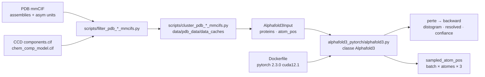

# lucidrains/alphafold3-pytorch

> **Réimplémentation PyTorch ouverte de l'architecture AlphaFold 3, à entraîner soi-même, sans poids fournis.**

## Le problème

AlphaFold 3 est décrit dans un article de *Nature* (Abramson et al., 2024) dont le code de
référence n'accompagne pas la publication sous une forme réutilisable librement. Qui veut
étudier l'architecture, en modifier un module ou l'entraîner sur ses propres structures doit
transcrire les algorithmes du supplément à la main, puis reconstruire toute la chaîne qui va
des fichiers mmCIF du PDB aux entrées atomiques du modèle.

## Ce que ça fait vraiment

Le dépôt fournit une classe `Alphafold3` en PyTorch, instanciable avec ses dimensions et la
profondeur de chacun de ses blocs (`pairformer_stack`, `msa_module_kwargs`,
`template_embedder_kwargs`, `diffusion_module_kwargs`, `confidence_head_kwargs`). Un même appel
sert aux deux régimes : avec `atom_pos` et les étiquettes (`distance_labels`,
`resolved_labels`), il renvoie une perte sur laquelle faire `backward()` ; sans elles, avec
`num_sample_steps`, il échantillonne des positions atomiques de forme `(batch, atom_seq_len, 3)`.

Deux niveaux d'entrée coexistent : le niveau atomique brut (`atom_inputs`, `atompair_inputs`,
`molecule_atom_lens`, `msa`, `templates`, à construire soi-même) et un niveau moléculaire,
`Alphafold3Input`, qui prend directement des séquences protéiques (`proteins = ['AG']`) et se
consomme via `forward_with_alphafold3_inputs`.

La seconde moitié du dépôt est la préparation de données : des scripts
`filter_pdb_{train,val,test}_mmcifs.py` et `cluster_pdb_{train,val,test}_mmcifs.py` qui filtrent
puis regroupent les complexes du PDB, plus le téléchargement du Chemical Component Dictionary
et des données de distillation. Le README crédite nommément les contributeurs des modules
(encodage positionnel relatif, perte LDDT lissée, alignement rigide pondéré, mesures de
confiance, pénalité de collision, classement des échantillons, `WeightedPDBSampler`, export
mmCIF, interface gradio).

## Comment c'est branché



Aucun diagramme tiré du code n'existe pour ce dépôt : ce schéma est reconstruit depuis le seul
README. Les noms de fichiers cités (`alphafold3_pytorch/alphafold3.py`, `tests/test_af3.py`,
`scripts/*.py`, `contribute.sh`, `Dockerfile`) sont ceux que le README donne explicitement,
notamment dans la section « Contributing ».

## Essayer

```bash
$ pip install alphafold3-pytorch
```

Le plus court chemin documenté vers un aller-retour complet est l'exemple à entrée moléculaire :

```python
import torch
from alphafold3_pytorch import Alphafold3, Alphafold3Input

contrived_protein = 'AG'

mock_atompos = [
    torch.randn(5, 3),   # alanine has 5 non-hydrogen atoms
    torch.randn(4, 3)    # glycine has 4 non-hydrogen atoms
]

train_alphafold3_input = Alphafold3Input(
    proteins = [contrived_protein],
    atom_pos = mock_atompos
)

eval_alphafold3_input = Alphafold3Input(
    proteins = [contrived_protein]
)
```

Par conteneur, avec GPU :

```bash
## Build Docker Container
docker build -t af3 .

## Run Container
docker run -v .:/data --gpus all -it af3
```

Pour contribuer et vérifier : `sh ./contribute.sh` à la racine, puis `pytest tests/`.

## Coût et pièges

- **Aucun poids entraîné n'est fourni.** Le README ne mentionne ni point de contrôle
  téléchargeable, ni modèle publié : `pip install` donne une architecture vide. Le coût réel
  est celui d'un entraînement complet, non chiffré dans le README.
- **700 Go de disque** pour le PDB, avertissement explicite du README. Une voie de repli
  existe : mmCIF préfiltrés (~25 Go, 148 k complexes) et fichiers de regroupement (~3 Go) sur
  un dossier OneDrive partagé, pour l'instantané AWS `20240101`.
- **La préparation des données est une chaîne à part entière** : `aws s3 sync` ou `rsync` depuis
  le RCSB, décompression, CCD, filtrage, regroupement, chacun son script et ses options.
- **GPU requis** en pratique : l'image Docker part de
  `pytorch/pytorch:2.3.0-cuda12.1-cudnn8-runtime` et s'exécute avec `--gpus all`. La VRAM
  nécessaire n'est pas documentée.
- **Piège d'indexation** dans l'exemple bas niveau : `distogram_atom_indices` et
  `molecule_atom_indices` doivent recevoir `atom_offsets` calculés par `exclusive_cumsum` avant
  l'appel. Se tromper là passe silencieusement.
- **Le drapeau `--clustering_filtered_pdb_dataset`** ne vaut que pour le jeu filtré par ces
  scripts ; l'utiliser sur d'autres mmCIF fausse le regroupement des interfaces.

## Ce que ce n'est pas

- **Ce n'est pas AlphaFold 3.** C'est une transcription indépendante de l'architecture décrite
  dans l'article, sans les poids de DeepMind et sans garantie de parité de résultats. Le README
  liste au contraire une longue série de correctifs de divergences avec le supplément et avec
  OpenFold (distogramme, vecteurs unitaires de gabarits, atomes non standard, hyperparamètres).
- **Ce n'est pas un outil de prédiction de structure prêt à l'emploi** : pas de commande qui
  prendrait une séquence FASTA et rendrait un PDB. On instancie un modèle, on l'entraîne.
- **Ce n'est pas une chaîne complète clés en main** : le README pointe un fork tiers pour le
  support Lightning + Hydra, et un autre projet pour les noyaux optimisés. L'interface gradio
  est mentionnée comme une contribution, sans commande d'usage.
- **Ce n'est pas un projet d'entreprise** : dépôt personnel, dépendant d'un mainteneur unique
  et de contributeurs bénévoles crédités un par un.

## Alternatives

| | Quand le préférer |
|---|---|
| **amorehead/alphafold3-pytorch-lightning-hydra** | Fork nommé dans le README, « maintenu par Alex », avec support complet Lightning + Hydra. À préférer dès qu'on veut des boucles d'entraînement, une configuration et une reprise déjà câblées plutôt que d'écrire les siennes. |
| **Supercomputing-System-AI-Lab/MegaFold** | Cité par le README comme « version optimisée s'appuyant sur des noyaux Triton ». À préférer quand le temps ou la mémoire d'entraînement dominent la lisibilité du code. |
| **lucidrains/vit-pytorch** | Voisin du catalogue, même auteur et même parti pris de réimplémentation lisible — mais pour les transformeurs de vision. À prendre comme repère de style, pas comme substitut. |

Les autres voisins proposés (`labmlai/annotated_deep_learning_paper_implementations`,
`Lightning-AI/pytorch-lightning`, `harvard-edge/cs249r_book`) ne sont pas comparables : ce sont
respectivement un recueil pédagogique d'implémentations annotées, un cadre d'entraînement
générique et un manuel — aucun ne prédit de structure biomoléculaire.

## Pour toi

Intérêt réel si la biologie structurale est ton domaine ou si tu veux lire une architecture de
diffusion conditionnée par MSA et gabarits, écrite d'un bloc et commentée par ses correctifs
successifs. Sans poids publiés ni budget d'entraînement, ce n'est pas un outil qu'on met en
production : à surveiller comme référence de code et comme point de départ de recherche, en
regardant d'abord le fork Lightning + Hydra si l'objectif est d'entraîner pour de vrai.
