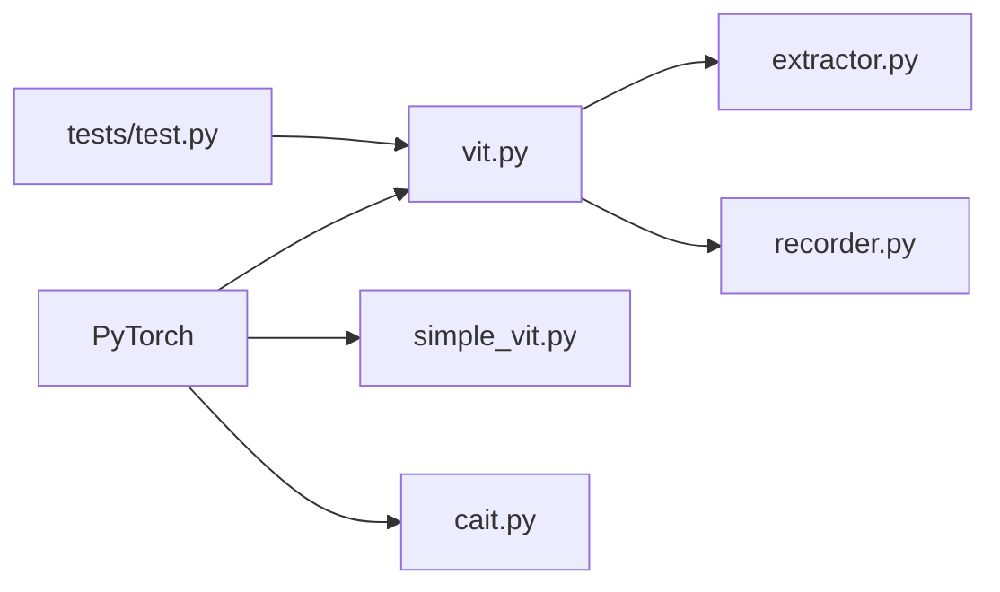

# lucidrains/vit-pytorch

> Collection PyTorch de dizaines de variantes de Vision Transformer, pour chercheurs et praticiens vision.

## Le problème
Comparer ou prototyper des variantes de ViT impose de réimplémenter chaque papier, avec ses subtilités d'attention et de patchs.

## Ce que ça fait vraiment
Chaque variante est un module autonome : ViT, SimpleViT, NaViT, CaiT, T2T, CCT, CrossViT, MaxViT, MobileViT, ViT 3D, ViViT…
Stratégies d'entraînement : distillation, SimMIM, MAE, Dino, EsViT, prédiction de patchs.
Wrappers `Recorder` (cartes d'attention) et `Extractor` (embeddings).
Pas de poids pré-entraînés : le README renvoie ailleurs pour cela.

## Comment c'est branché


## Essayer
```bash
pip install vit-pytorch
```

## Coût et pièges
Gratuit, MIT. Entraînement from scratch coûteux en GPU puisqu'aucun poids n'est fourni.

## Ce que ce n'est pas
Pas un hub de modèles pré-entraînés. Implémentations de papiers, pas reproductions validées des scores.

## Alternatives
- Dépôt de Ross Wightman (timm) : ViT PyTorch avec poids pré-entraînés.
- Dépôt officiel Jax : implémentation de référence.

## Pour toi
Adopter comme référence de code : idéal pour comprendre ou prototyper une variante ViT, en sachant qu'il faut timm pour des poids prêts à l'emploi.
