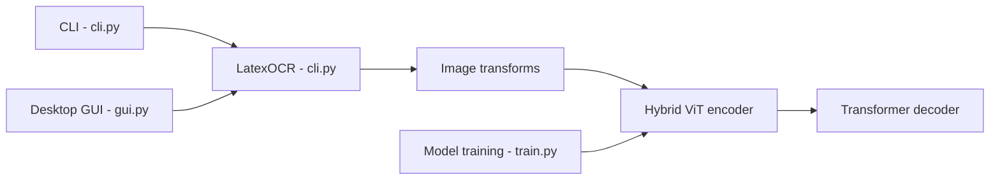

# lukas-blecher/LaTeX-OCR

> Modèle pix2tex qui convertit l'image d'une formule mathématique en code LaTeX.

## Le problème
Retranscrire à la main des formules vues dans un PDF ou une capture d'écran.

## Ce que ça fait vraiment
Un encodeur ViT à base ResNet et un décodeur Transformer produisent du LaTeX. Un second réseau prédit la résolution optimale d'entrée. Interfaces : CLI `pix2tex`, GUI `latexocr` avec capture d'écran et rendu MathJax, API Streamlit/Docker, appel Python. Scores annoncés : BLEU 0,88, distance d'édition normalisée 0,10, précision par jeton 0,60. Génération de données par XeLaTeX.

## Comment c'est branché


## Essayer
```bash
pip install "pix2tex[gui]"
pix2tex
latexocr
pip install -U "pix2tex[api]"
python -m pix2tex.api.run
```

## Coût et pièges
Gratuit ; les poids se téléchargent automatiquement. Dernier push en janvier 2025. Les images trop grandes passent mal ; relire le résultat.

## Ce que ce n'est pas
Pas fiable à 100 % (précision par jeton de 0,60). Les formules manuscrites ne sont qu'à moitié gérées, et la recherche par faisceau n'est pas faite.

## Alternatives
Aucune alternative nommée dans le README.

## Pour toi
À surveiller : pratique pour gagner du temps sur des formules, mais précision moyenne et projet peu actif.

