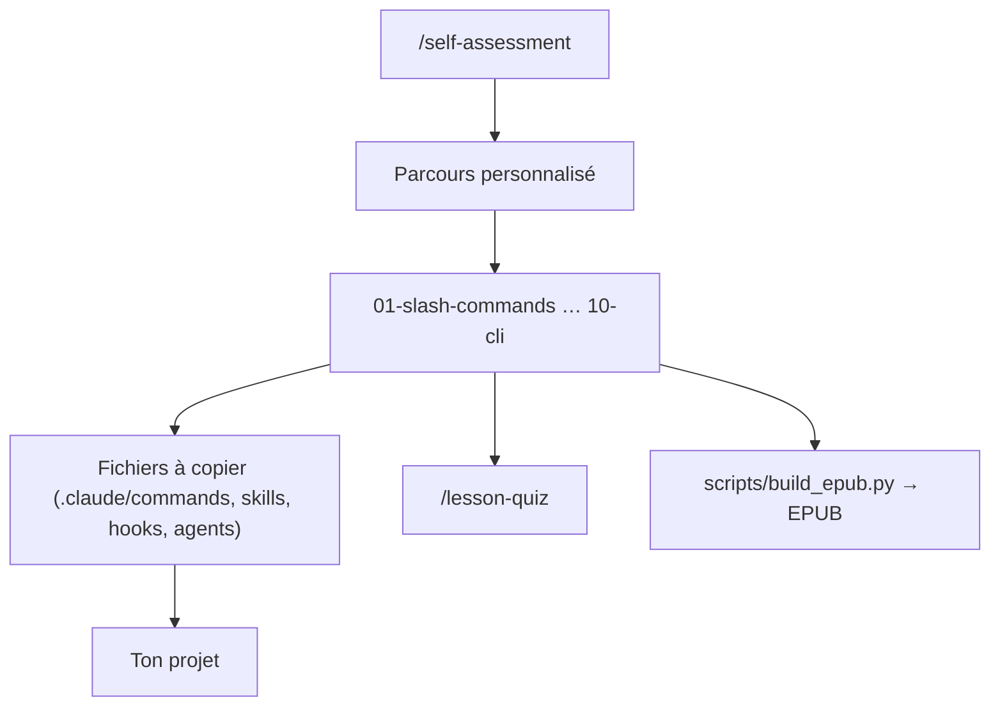

# luongnv89/claude-howto

> Guide progressif en dix modules pour combiner les fonctionnalités de Claude Code.

## Le problème
La documentation officielle décrit les fonctionnalités une à une, sans montrer comment les
chaîner, ni dans quel ordre les apprendre.

## Ce que ça fait vraiment
Propose dix modules ordonnés — slash commands, mémoire, checkpoints, CLI, skills, hooks, MCP,
sous-agents, fonctionnalités avancées, plugins — avec un temps annoncé par module, 11 à 13 heures
au total, et trois points d'entrée selon le niveau.
Livre des fichiers à copier : commandes, `CLAUDE.md`, scripts de hooks, configurations MCP,
définitions de sous-agents et bundles de plugins, rangés par dossier numéroté.
Ajoute des diagrammes Mermaid du fonctionnement interne et deux commandes d'auto-évaluation,
`/self-assessment` et `/lesson-quiz <sujet>`. Le contenu s'exporte en EPUB pour lecture hors ligne.

## Comment c'est branché


## Essayer
```bash
git clone https://github.com/luongnv89/claude-howto.git
cd claude-howto
mkdir -p /path/to/your-project/.claude/commands
cp 01-slash-commands/optimize.md /path/to/your-project/.claude/commands/
cp 02-memory/project-CLAUDE.md /path/to/your-project/CLAUDE.md
cp -r 03-skills/code-review-specialist ~/.claude/skills/
uv run scripts/build_epub.py
```

## Coût et pièges
Gratuit, MIT. Rien à installer hormis Claude Code lui-même. Le contenu est daté : il s'annonce
synchronisé avec la version v2.1.278 (septembre 2026), donc les listes de hooks, de modes de
permission et de modèles vieilliront — à revérifier contre la documentation officielle avant de copier.

## Ce que ce n'est pas
Ce n'est pas la documentation officielle et ne la remplace pas : le README se positionne en
complément. Ce n'est pas un outil : rien ne s'exécute, ce sont des fichiers et des explications.
Les gabarits sont des points de départ, pas des configurations relues pour ton contexte.

## Alternatives
- **Documentation officielle Claude Code** : référence des fonctionnalités, citée comme complémentaire.
- **Anthropic Cookbook** : exemples officiels, cité en ressource.

## Pour toi
Utile une fois, pour repérer ce que tu n'utilises pas encore ; pas un dépôt à suivre.
