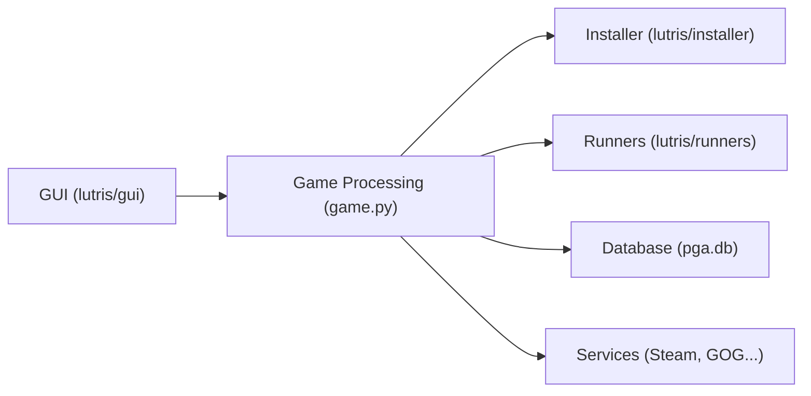

# lutris/lutris

> Lanceur de jeux Linux qui installe et lance des jeux de toutes époques via émulateurs et couches de compatibilité.

## Le problème
Installer et lancer des jeux venant de systèmes et de boutiques variés demande de configurer à la main émulateurs, Wine et dépendances.

## Ce que ça fait vraiment
Interface graphique (Python) qui automatise l'installation par des scripts JSON ou YAML, télécharge les « runners » (émulateurs, Wine), et relie les bibliothèques Humble Bundle, GOG et Steam. Une base SQLite (`pga.db`) suit la bibliothèque. Trois niveaux de configuration se superposent : système, runner, jeu. Une ligne de commande permet installation, export/import et liste.

## Comment c'est branché


## Essayer
```bash
./bin/lutris
./bin/lutris -d
lutris lutris:quake
```

## Coût et pièges
Gratuit, financé par dons (Patreon). Le README recommande d'installer Lutris au moins une fois par le gestionnaire de paquets pour obtenir les dépendances.

## Ce que ce n'est pas
Pas un émulateur : il orchestre ceux qui existent. Un compte lutris.net est optionnel, seul un jeton est stocké localement.

## Alternatives
Aucune alternative nommée dans le README.

## Pour toi
À ignorer : outil de jeu sans rapport avec le travail data/IA/MLOps.

