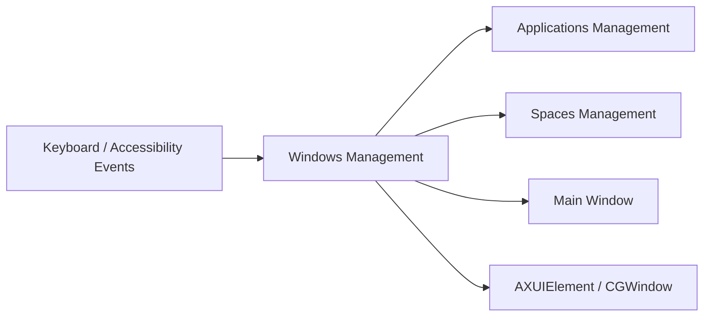

# lwouis/alt-tab-macos

> Sélecteur de fenêtres à la Windows pour macOS, d'après le code, faute de README.

## Le problème
Le README est vide ou tronqué : le problème visé n'est pas documenté. D'après le nom et l'architecture, il s'agit de remplacer le sélecteur d'applications de macOS.

## Ce que ça fait vraiment
Non documenté dans le README. D'après l'architecture tirée du code : une application Swift qui gère fenêtres, applications et Spaces, écoute des événements (accessibilité, clavier, souris, Dock) et affiche des vignettes dans un panneau. Dépendances citées : Sparkle (mises à jour), ShortcutRecorder, SwiftyBeaver, AppCenter.

## Comment c'est branché

## Essayer
Aucune commande documentée : README absent.

## Coût et pièges
Licence GPL-3.0 (copyleft). Utilise des API privées de macOS d'après le graphe, ce qui peut casser à chaque mise à jour du système. Installation non documentée ici.

## Ce que ce n'est pas
Ce n'est pas un outil pour le travail data/IA. Ne pas déduire ses fonctions au-delà du graphe.

## Alternatives
Aucune alternative nommée (README vide).

## Pour toi
À ignorer : utilitaire macOS sans lien avec la data ou le MLOps, et matière trop mince pour juger plus.

