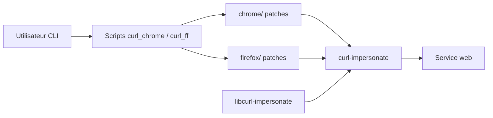

# lwthiker/curl-impersonate

> Build spécial de curl dont les poignées de main TLS et HTTP/2 imitent Chrome, Edge, Safari ou Firefox.

## Le problème
Les serveurs identifient le client par l'empreinte de son Client Hello TLS et de ses réglages HTTP/2. Curl et les bibliothèques HTTP standard n'ont pas la même empreinte qu'un navigateur et reçoivent un contenu différent ou un refus.

## Ce que ça fait vraiment
Curl patché : compilé avec NSS pour la version Firefox et BoringSSL pour la version Chrome, avec extensions TLS, options HTTP/2 et en-têtes ajustés. Des scripts wrapper (`curl_chrome116`, `curl_ff109`…) lancent curl avec les bons drapeaux. Existe aussi en `libcurl-impersonate.so`, avec la fonction `curl_easy_impersonate()` ou la variable `CURL_IMPERSONATE` via `LD_PRELOAD`.

## Comment c'est branché


## Essayer
```bash
curl_chrome116 https://www.wikipedia.org
docker pull lwthiker/curl-impersonate:0.6-chrome
docker run --rm lwthiker/curl-impersonate:0.6-chrome curl_chrome110 https://www.wikipedia.org
LD_PRELOAD=/path/to/libcurl-impersonate.so CURL_IMPERSONATE=chrome116 my_app
```

## Coût et pièges
Gratuit. Binaires précompilés Linux et macOS Intel ; la version Firefox exige NSS installé. Certains drapeaux curl changent la signature TLS et font repérer le client. Dernier push en juillet 2024 : les profils de navigateur vieillissent.

## Ce que ce n'est pas
Ce n'est pas un navigateur : pas de JavaScript ni de rendu. Le `LD_PRELOAD` ne marche pas pour la commande `curl` elle-même. Les profils sont figés sur des versions de navigateur précises.

## Alternatives
Curl standard : sans imitation, mais maintenu et plus simple si le serveur ne filtre pas.

## Pour toi
Surveiller : utile pour le scraping de jeux de données derrière un filtrage d'empreinte TLS, mais mainteneur unique et profils qui se périment.

