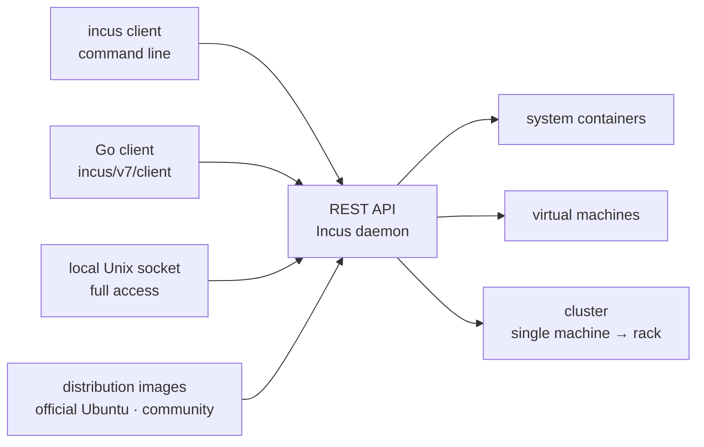

# lxc/incus

> **A manager for Linux system containers and virtual machines, driven by a single REST API.**

## The problem

Running several complete Linux environments on one machine usually means picking between two
separate worlds — containers on one side, virtual machines on the other — with different tools,
image formats and administration models. Moving from a developer laptop to a production rack
then forces yet another change of tooling.

## What it actually does

Incus manages **complete Linux systems** — not application processes — inside containers *or*
virtual machines, through the same interface for both. The README makes this its main claim: "a
unified experience".

It ships images for a large number of Linux distributions: official Ubuntu images and images
provided by the community.

Everything is built around a **REST API**, which the README describes as the foundation of the
project. A Go client is published and documented (`github.com/lxc/incus/v7/client`), making it a
programmable entry point rather than only a command line.

The same product covers a single instance on one machine and a **cluster** spread across a data
centre rack, for development as well as production workloads. The README frames the intended use
as "a system that feels like a small private cloud".

The project is a **community fork of LXD**, started after Canonical's takeover of LXD, then
adopted by the Linux Containers community. It is maintained by the same developers who created
LXD, free of any contributor licence agreement, under Apache 2.0.

## How it is wired



No code-derived diagram exists for this repository: the graph above is reconstructed from the
README alone. The thing to keep is the **two doors** into the same daemon: the remote REST API,
which can be restricted, and the local Unix socket, which the README says *always* grants full
access — the two are not secured the same way.

## Trying it

The README contains **no installation or usage command**. It points to documentation hosted
outside the repository:

```
https://linuxcontainers.org/incus/docs/main/tutorial/first_steps/   # installation and first steps
https://linuxcontainers.org/incus/docs/main/                        # documentation
https://github.com/lxc/incus/tree/main/doc                          # in-repository documentation
https://github.com/lxc/incus/releases/                              # release tarballs
https://linuxcontainers.org/incus/try-it/                           # online trial, nothing to install
```

Nothing is reconstructed here: no command line is documented in the README that was read.

## Cost and pitfalls

- **The software is free** and Apache 2.0 licensed. The README mentions **commercial support**
  available from Zabbly for users of its Debian or Ubuntu packages: that is the only monetary
  cost named, and it is optional.
- **The local Unix socket is root in disguise.** The README flags this as IMPORTANT: local
  access through the socket always grants full control, including attaching filesystem paths or
  devices to any instance and changing the security settings of any instance. Grant it only to
  users you would trust with root on the host.
- **Privileged containers**: not to be used unless required, and then with appropriate security
  measures — the README points to the LXC security page.
- **Left to the administrator**: keeping the operating system patched, running only supported
  Incus versions, restricting access to the daemon and the remote API, and configuring network
  interfaces securely.
- **The README documents nothing operational**: no hardware prerequisites, no installation
  route, no memory or disk footprint. All of that lives off-repository — which is why the French
  card carries the "insufficient material" alert: not that the project is thin, but that this
  page alone cannot support a decision.

## What it is not

- **It is not Docker or an application-container engine.** Incus manages full Linux *systems*,
  not one process per container: the mental model is a machine, not a disposable application
  image.
- **It is not a Kubernetes-style orchestrator.** The README talks about clustering and scaling
  to a rack, never about scheduling applications, services or declarative deployments.
- **It is not LXD, and the README promises no compatibility.** It is a fork that diverged after
  Canonical took over LXD; the README recounts the shared origin, not an equivalence.
- **It is not a hosted service.** The online trial on linuxcontainers.org is a demonstration; in
  real use this is a daemon you host and secure yourself.
- **It is not broadly cross-platform**: what runs inside are Linux systems, built from Linux
  distribution images.

## Alternatives

| | When to pick it instead |
|---|---|
| **LXD (Canonical)** | Named in the README as the project Incus forked from, after Canonical's takeover. Pick it to stay inside Canonical's ecosystem and support; pick Incus for community governance with no contributor licence agreement. |
| **zabbly/incus** | Named in the README: Debian and Ubuntu packages of the same software, with commercial support. Pick it if you want maintained packages and a support contract rather than raw release tarballs. |

The catalogue neighbours (`aquasecurity/trivy`, `goharbor/harbor`, `pulumi/pulumi`,
`slimtoolkit/slim`) are not comparable: respectively a vulnerability scanner, an image registry,
a declarative infrastructure tool and a container-image slimmer — none of them runs complete
Linux systems.

## For you

Useful as **substrate**, not as part of the data toolchain. This is the brick that gives you
disposable but complete Linux machines — reproducible test benches, isolated training
environments, virtual machines for whatever does not containerise (specific kernel, GPU driver,
filesystem). The REST API and Go client make it a fleet you can drive from code. Do not confuse
it with model or service packaging: to ship an application, you stay on application images.
