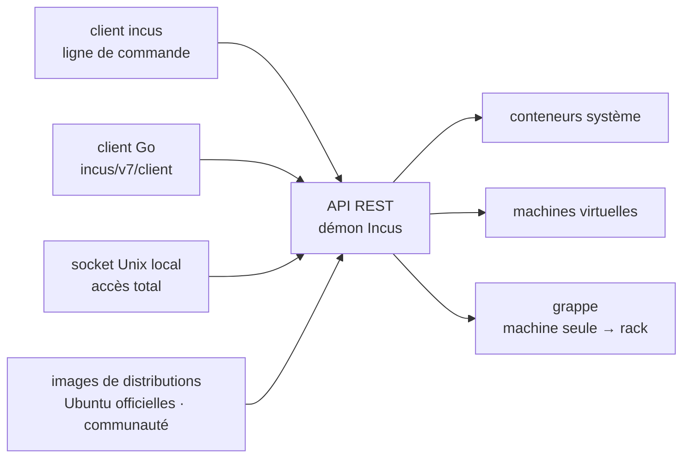

# lxc/incus

> **Gestionnaire de conteneurs système et de machines virtuelles Linux, piloté par une API REST unique.**

## Le problème

Faire tourner plusieurs environnements Linux complets sur une même machine oblige à choisir
entre deux mondes séparés : les conteneurs d'un côté, les machines virtuelles de l'autre, avec
des outils, des formats d'image et des modes d'administration distincts. Passer de la machine
de développement à un rack de production impose en général de changer encore d'outillage.

## Ce que ça fait vraiment

Incus gère des **systèmes Linux complets** — pas des processus applicatifs — à l'intérieur de
conteneurs *ou* de machines virtuelles, avec la même interface pour les deux. Le README insiste
sur ce point : « une expérience unifiée ».

Il fournit un catalogue d'images pour un grand nombre de distributions Linux : images Ubuntu
officielles et images fournies par la communauté.

Tout est construit autour d'une **API REST**, décrite par le README comme le socle du projet.
Le client Go est publié et documenté (`github.com/lxc/incus/v7/client`), ce qui en fait un point
d'entrée programmable et non seulement une ligne de commande.

Le même produit couvre l'échelle d'une instance unique sur une machine et celle d'une **grappe**
répartie sur un rack de centre de données, pour du développement comme pour de la production.
Le README résume l'usage visé comme « un système qui ressemble à un petit cloud privé ».

Le projet est un **fork communautaire de LXD**, créé après la reprise en main de LXD par
Canonical, puis adopté par la communauté Linux Containers. Il est maintenu par l'équipe de
développeurs qui avait créé LXD, sans accord de cession de droits (CLA), sous licence Apache 2.0.

## Comment c'est branché



Aucun diagramme tiré du code n'existe pour ce dépôt : ce schéma est reconstruit depuis le seul
README. Le point à retenir est la **double entrée** vers le même démon : l'API REST distante,
qu'on peut restreindre, et le socket Unix local, dont le README écrit qu'il accorde *toujours*
un accès complet — les deux ne se sécurisent pas de la même façon.

## Essayer

Le README ne contient **aucune commande d'installation ni d'usage**. Il renvoie à la
documentation hors dépôt :

```
https://linuxcontainers.org/incus/docs/main/tutorial/first_steps/   # installation et premiers pas
https://linuxcontainers.org/incus/docs/main/                        # documentation
https://github.com/lxc/incus/tree/main/doc                          # documentation dans le dépôt
https://github.com/lxc/incus/releases/                              # archives de publication
https://linuxcontainers.org/incus/try-it/                           # essai en ligne, sans rien installer
```

Rien n'est reconstruit ici : aucune ligne de commande n'est documentée dans le README lu.

## Coût et pièges

- **Le logiciel est gratuit** et sous Apache 2.0. Le README mentionne un **support commercial**
  disponible auprès de Zabbly, pour les utilisateurs de ses paquets Debian ou Ubuntu : c'est le
  seul coût monétaire cité, et il est facultatif.
- **Le socket Unix local est un accès root déguisé.** Le README le marque en IMPORTANT :
  l'accès local par le socket accorde toujours un contrôle total, y compris attacher des chemins
  du système de fichiers ou des périphériques à n'importe quelle instance, et modifier les
  réglages de sécurité de n'importe quelle instance. À ne donner qu'à des utilisateurs à qui on
  confierait le root de la machine.
- **Conteneurs privilégiés** : à ne pas utiliser sauf nécessité, et alors avec des mesures de
  sécurité propres — le README renvoie à la page de sécurité de LXC.
- **Reste à la charge de l'administrateur** : système d'exploitation à jour et correctifs de
  sécurité installés, versions d'Incus supportées uniquement, accès au démon et à l'API distante
  restreint, interfaces réseau configurées de façon sûre.
- **Le README ne documente rien d'opérationnel** : ni prérequis matériels, ni mode
  d'installation, ni empreinte mémoire ou disque. Tout cela est hors dépôt. C'est la raison de
  l'alerte `matière insuffisante` — non pas que le projet soit maigre, mais que cette page-ci ne
  permet pas de décider seule.

## Ce que ce n'est pas

- **Ce n'est pas Docker ni un moteur de conteneurs applicatifs.** Incus gère des *systèmes*
  Linux complets, pas un processus par conteneur : le modèle mental est celui d'une machine, pas
  d'une image applicative jetable.
- **Ce n'est pas un orchestrateur façon Kubernetes.** Le README parle de grappe et de mise à
  l'échelle jusqu'au rack, jamais d'ordonnancement d'applications, de services ou de
  déploiements déclaratifs.
- **Ce n'est pas LXD, et la compatibilité n'est pas promise dans le README.** C'est un fork qui
  a divergé après la reprise de LXD par Canonical ; le README raconte l'origine commune, pas une
  équivalence.
- **Ce n'est pas un service hébergé.** L'essai en ligne proposé par linuxcontainers.org est une
  démonstration ; en usage réel, c'est un démon qu'on héberge et qu'on sécurise soi-même.
- **Ce n'est pas un outil multiplateforme au sens large** : ce qui tourne dedans, ce sont des
  systèmes Linux, à partir d'images de distributions Linux.

## Alternatives

| | Quand le préférer |
|---|---|
| **LXD (Canonical)** | Nommé dans le README comme le projet dont Incus est le fork, après la reprise par Canonical. À préférer si l'on veut rester dans l'écosystème et le support de Canonical ; Incus à préférer pour une gouvernance communautaire sans CLA. |
| **zabbly/incus** | Nommé dans le README : paquets Debian et Ubuntu du même logiciel, avec support commercial. À préférer si l'on veut des paquets maintenus et un contrat de support plutôt que les archives de publication brutes. |

Les voisins proposés par le catalogue (`aquasecurity/trivy`, `goharbor/harbor`,
`pulumi/pulumi`, `slimtoolkit/slim`) ne sont pas comparables : ce sont respectivement un
scanner de vulnérabilités, un registre d'images, un outil d'infrastructure déclarative et un
réducteur d'images de conteneur — aucun ne gère l'exécution de systèmes Linux complets.

## Pour toi

Utile comme **substrat**, pas comme outil de la chaîne data. C'est la brique qui donne des
machines Linux jetables mais complètes — bancs d'essai reproductibles, environnements
d'entraînement isolés, machines virtuelles pour ce qui ne se conteneurise pas (noyau
particulier, pilote GPU, système de fichiers). L'API REST et le client Go permettent d'en faire
un parc piloté par code. À ne pas confondre avec l'outillage d'empaquetage d'un modèle ou d'un
service : pour livrer une application, on reste sur des images applicatives.
