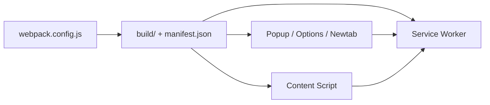

# lxieyang/chrome-extension-boilerplate-react

> Gabarit d'extension Chrome (Manifest V3) avec React 18 et Webpack 5, pour développeurs d'extensions.

## Le problème
Démarrer une extension Chrome moderne oblige à configurer bundling, rechargement à chaud et pages multiples.

## Ce que ça fait vraiment
Fournit popup, options, page nouvel onglet, devtools, panneau, service worker et content script, empaquetés par Webpack 5 avec React Refresh. TypeScript pour Options et Panel, gestion de secrets par fichiers `secrets.*.js`, build de production dans `build/`.

## Comment c'est branché


## Essayer
```bash
npm install
npm start
NODE_ENV=production npm run build
```

## Coût et pièges
Gratuit. Node ≥ 18. Chargement manuel dans `chrome://extensions/` (dossier `build`).

## Ce que ce n'est pas
Dépôt archivé, dernier push en juillet 2024 : plus de mises à jour de dépendances malgré l'invitation à ouvrir des tickets.

## Alternatives
- chrome-extension-webpack-boilerplate (samuelsimoes) : dont ce gabarit est adapté.

## Pour toi
À ignorer : archivé et sans rapport avec le périmètre data/IA/MLOps.

