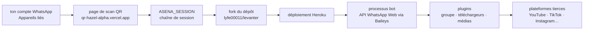

# lyfe00011/whatsapp-bot

> **A bot that drives your own WhatsApp account, deployed to Heroku through a web form.**

## The problem

WhatsApp exposes no public API for a personal account: moderating a group, pulling down a
media file, turning a video into a sticker all happen by hand, one message at a time. The
README never states this problem; it can only be inferred from the command catalogue it
offers, which leans towards group moderation and media downloading.

## What it actually does

This is a *userbot*: it does not create a separate robot account, it acts under your own
identity through the WhatsApp Web API. The README says so plainly — "does not log into your
account", it is written on the WhatsApp Web API — and presents the project as a derivative of
Yusuf Usta's WhatsAsena.

The whole substance of the README is a table of commands marked active. Three families: group
administration (Kick, Add, Warn, Vote, Invite, Revoke, Promote/Demote, Welcome/Goodbye,
Mute/Unmute, Schedule), media downloading from third-party platforms (YouTube audio and
video, TikTok, Twitter, Facebook, Instagram, Pinterest, SoundCloud, Saavn, Mediafire,
Unsplash), and a set of file-processing utilities (sticker, mp3, pdf, trim, merge, compress,
reverse, removebg, Google reverse image search, OCR through `Txt`, translation through `Trt`,
weather, Wikipedia).

One command, `Lydia`, is listed as "Auto AI chat" with no further detail: no model, no
provider, no key requirement. The README documents no architecture, no file, and no
configuration variable other than `ASENA_SESSION`. The plugin list points to a GitHub wiki,
outside the repository.

## How it is wired



No code-derived diagram exists for this repository: the graph is reconstructed from the README
alone, so it describes the install procedure rather than the internal layout of the code,
which the README never addresses.

## Trying it

```bash
# No shell command is documented in the README.
# The described install is entirely click-based:
#  1. open https://qr-hazel-alpha.vercel.app/ and scan the QR from
#     WhatsApp > Linked Devices; collect the ASENA_SESSION string
#  2. create a Heroku account
#  3. fork https://github.com/lyfe00011/levanter
#  4. open the same page again to deploy, supplying ASENA_SESSION
```

No `npm install`, no `docker run`, no sample file: there is nothing in the repository to copy.

## Cost and traps

The repository is free, but the procedure requires a Heroku account — whose free tier no
longer exists — and routes your WhatsApp session through a third-party web page hosted on
Vercel and controlled by the maintainer. That session string is full access to your account:
this is the real cost. The README does not explain what the page does with the value it
produces, nor whether scanning happens client-side.

Other traps: the licence is undeclared in the catalogue, so no usage right is formally
granted; steps 4 and 5 point to a *different* repository by the same author (`levanter`),
which suggests this one is no longer the active target; and running a userbot on WhatsApp
exposes the account to the platform's usage rules, a subject the README never raises.

## What it is not

It is not an enterprise bot on the official WhatsApp Business API: there is no dedicated
number, no webhook, no compliance story — it acts under your personal account.

Nor is it a library: nothing here is importable, and the actual connection work is done by
Baileys, thanked at the end of the README. This repository is a plugin collection on top of
that, plus a deployment path.

Finally, it is not a documented project: commands are announced in a table with no syntax, no
example, and no mention of the API keys that translation, OCR, weather or background removal
necessarily require — a gap left entirely to the reader.

## Alternatives

- **yusufusta/WhatsAsena** — the project this one derives from, named in the README; prefer it
  if you want the upstream source rather than an enriched fork.
- **adiwajshing/Baileys** — the library that actually speaks to the WhatsApp Web API, named in
  the credits; the right starting point for writing your own client instead of inheriting a
  plugin catalogue.
- **lyfe00011/levanter** — the repository the fork and deploy steps point to, by the same
  author; worth looking at first, since it is what you actually deploy.

The batch offers no catalogue neighbours for this repository, so no external comparison is
possible here.

## For you

Nothing to take away for a data, AI or MLOps profile: no model, no reusable data processing,
no code worth reading. The one technically interesting part, the WhatsApp connection, belongs
to Baileys. Walk past this one, and look at Baileys directly if the subject ever becomes
relevant.
