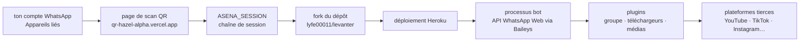

# lyfe00011/whatsapp-bot

> **Un bot qui pilote ton propre compte WhatsApp, déployé chez Heroku via un formulaire web.**

## Le problème

WhatsApp n'offre pas d'API publique pour un compte personnel : administrer un groupe,
rapatrier un média, convertir une vidéo en sticker se fait à la main, message par message.
Le README ne formule jamais ce problème ; il se déduit du catalogue de commandes qu'il
propose, orienté modération de groupe et téléchargement de médias.

## Ce que ça fait vraiment

C'est un *userbot* : il ne crée pas un compte de robot séparé, il agit sous ton identité via
l'API WhatsApp Web. Le README le dit explicitement — « does not log into your account »,
il s'appuie sur l'API Web — et le présente comme un dérivé de WhatsAsena, de Yusuf Usta.

Tout le contenu utile du README est une table de commandes, déclarées actives. Trois
familles : administration de groupe (Kick, Add, Warn, Vote, Invite, Revoke, Promote/Demote,
Welcome/Goodbye, Mute/Unmute, Schedule), téléchargement de médias depuis des plateformes
tierces (YouTube audio et vidéo, TikTok, Twitter, Facebook, Instagram, Pinterest, SoundCloud,
Saavn, Mediafire, Unsplash), et un lot d'utilitaires de traitement de fichiers (sticker,
mp3, pdf, trim, merge, compress, reverse, removebg, Google reverse image, OCR via `Txt`,
traduction via `Trt`, météo, Wikipédia).

Une commande `Lydia` est annoncée comme « Auto AI chat », sans autre détail : ni modèle, ni
fournisseur, ni clé requise. Le README ne documente aucune architecture, aucun fichier,
aucune variable de configuration hors `ASENA_SESSION`. La liste des plugins renvoie à un wiki
GitHub, hors du dépôt.

## Comment c'est branché



Aucun diagramme tiré du code n'existe pour ce dépôt : ce schéma est reconstruit depuis le seul
README, donc il décrit la procédure d'installation, pas l'organisation interne du code — que
le README n'aborde nulle part.

## Essayer

```bash
# Aucune commande shell n'est documentée dans le README.
# L'installation décrite est entièrement en clics :
#  1. ouvrir https://qr-hazel-alpha.vercel.app/ et scanner le QR depuis
#     WhatsApp > Appareils liés ; récupérer la chaîne ASENA_SESSION
#  2. créer un compte Heroku
#  3. forker https://github.com/lyfe00011/levanter
#  4. relancer la même page pour déployer, en fournissant ASENA_SESSION
```

Ni `npm install`, ni `docker run`, ni fichier d'exemple : rien à copier depuis le dépôt.

## Coût et pièges

Le dépôt est gratuit, mais la procédure impose un compte Heroku — dont le palier gratuit
n'existe plus — et fait transiter ta session WhatsApp par une page web tierce hébergée sur
Vercel, contrôlée par le mainteneur. Cette chaîne de session vaut un accès complet à ton
compte : c'est le vrai coût. Le README n'explique pas ce que la page fait de la valeur
générée, ni si le scan se fait côté client.

Autres pièges : la licence n'est pas déclarée dans le catalogue, donc aucun droit d'usage
n'est accordé formellement ; les étapes 4 et 5 pointent vers un *autre* dépôt du même auteur
(`levanter`), ce qui laisse penser que celui-ci n'est plus la cible active ; et un userbot
sur WhatsApp expose le compte aux règles d'usage de la plateforme, sujet que le README
n'évoque pas.

## Ce que ce n'est pas

Ce n'est pas un bot d'entreprise sur l'API officielle WhatsApp Business : il n'y a ni numéro
dédié, ni webhook, ni conformité — il agit sous ton compte personnel.

Ce n'est pas non plus une bibliothèque : rien ici ne s'importe, le travail de connexion est
fait par Baileys, remercié en fin de README. Ce dépôt est une collection de plugins
au-dessus, plus un chemin de déploiement.

Enfin, ce n'est pas un projet documenté : les commandes sont annoncées dans une table, sans
syntaxe, sans exemple, sans mention des clés d'API qu'exigent forcément la traduction, l'OCR,
la météo ou le retrait d'arrière-plan.

## Alternatives

- **yusufusta/WhatsAsena** — le projet dont celui-ci est dérivé, nommé dans le README ; à
  préférer si l'on veut la source amont plutôt qu'un fork enrichi.
- **adiwajshing/Baileys** — la bibliothèque qui parle réellement à l'API WhatsApp Web, nommée
  dans les remerciements ; c'est le bon point de départ pour écrire son propre client au lieu
  d'hériter d'un catalogue de plugins.
- **lyfe00011/levanter** — le dépôt vers lequel pointent les étapes de fork et de déploiement,
  du même auteur ; à regarder d'abord, puisque c'est lui qu'on déploie en pratique.

Le lot ne propose aucun voisin de catalogue pour ce dépôt, donc aucune comparaison externe
n'est possible ici.

## Pour toi

Rien à en tirer pour un profil data, IA ou MLOps : pas de modèle, pas de traitement de
données réutilisable, pas de code à lire. Le seul point d'intérêt technique, la connexion à
WhatsApp, appartient à Baileys. Passe ton chemin, et regarde Baileys directement si le sujet
te concerne un jour.
