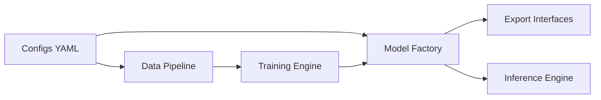

# lyuwenyu/RT-DETR

> Implémentation officielle de RT-DETR et RT-DETRv2, détecteurs d'objets temps réel à transformers, pour chercheurs en vision.

## Le problème
Les détecteurs de la famille YOLO dominaient le temps réel ; il fallait un détecteur à transformers aussi rapide sans post-traitement NMS.

## Ce que ça fait vraiment
Fournit le code et les poids en PaddlePaddle et PyTorch, pour v1 et v2, avec configurations YAML, scripts d'entraînement, d'inférence, d'export et de profilage. Le README publie un tableau COCO (par exemple R18 : 46,5 AP, 217 FPS sur T4 en TensorRT FP16). Un port communautaire Android est cité.

## Comment c'est branché

## Essayer
Le README fourni ne contient aucune commande d'installation ou d'exécution ; les instructions sont dans les sous-dossiers d'implémentation, non lus ici.

## Coût et pièges
GPU nécessaire pour entraîner. Une extension CUDA/C++ (attention déformable) existe côté Paddle. Environ 420 issues ouvertes.

## Ce que ce n'est pas
Pas une bibliothèque packagée : c'est un dépôt de recherche avec deux piles parallèles (Paddle et PyTorch). Le README est court et n'explique pas l'usage.

## Alternatives
Le README ne nomme aucune alternative.

## Pour toi
À surveiller : référence solide pour la détection temps réel, mais à ouvrir seulement si tu as un besoin de vision ; le README seul ne suffit pas à démarrer.
