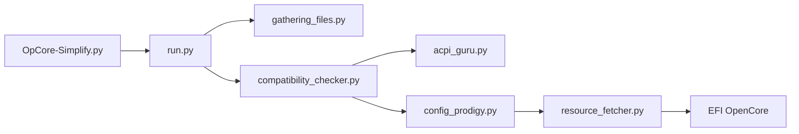

# lzhoang2801/OpCore-Simplify

> Script Python qui génère un dossier EFI OpenCore pour Hackintosh à partir d'un rapport matériel.

## Le problème
Construire à la main une configuration OpenCore (patchs ACPI, kexts, SMBIOS) pour faire tourner macOS sur un PC est long et sujet aux erreurs.

## Ce que ça fait vraiment
À partir d'un rapport matériel (export Windows ou Hardware Sniffer) et d'une base de données embarquée de CPU, GPU et chipsets, il choisit les patchs ACPI, les kexts et les réglages SMBIOS, télécharge OpenCorePkg et les kexts depuis Dortania et GitHub, puis assemble l'EFI. Le README prévient qu'il ne garantit pas une installation réussie au premier essai.

## Comment c'est branché


## Essayer
```bash
# Windows : lancer OpCore-Simplify.bat
# macOS : lancer OpCore-Simplify.command
# Linux :
python OpCore-Simplify.py
```

## Coût et pièges
Gratuit, mais réseau nécessaire à chaque build (téléchargement des kexts). Il faut déjà comprendre le guide Dortania, tester et dépanner l'installation.

## Ce que ce n'est pas
Pas un installateur clé en main de macOS. L'installation sur matériel non Apple reste un travail de dépannage, et les personnalisations manuelles sont « non recommandées » selon le README.

## Alternatives
SSDTTime (utilisé en intégration), OpenCorePkg et le guide Dortania (la voie manuelle citée).

## Pour toi
À ignorer : c'est de l'outillage Hackintosh sans rapport avec un travail data/IA/MLOps, sauf si tu montes toi-même un poste macOS sur PC.

