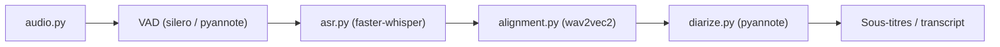

# m-bain/whisperX

> Transcription Whisper accélérée avec horodatage par mot et identification des locuteurs, pour la parole longue.

## Le problème
Whisper seul est lent, ses horodatages sont au niveau de la phrase (et parfois faux de plusieurs secondes) et il ne sépare pas les locuteurs.

## Ce que ça fait vraiment
Pipeline : détection d'activité vocale (VAD), transcription par lots avec le backend faster-whisper, alignement forcé wav2vec2 pour les horodatages par mot, puis diarisation pyannote optionnelle. Le README annonce 70x le temps réel avec large-v2 et moins de 8 Go de GPU. Limites déclarées : mots non alignables (nombres, montants), parole superposée, diarisation imparfaite.

## Comment c'est branché


## Essayer
```bash
pip install whisperx
whisperx path/to/audio.wav
whisperx path/to/audio.wav --model large-v2 --diarize --highlight_words True
whisperx path/to/audio.wav --compute_type int8 --device cpu
```

## Coût et pièges
GPU conseillé (CUDA 12.8). La diarisation exige un jeton Hugging Face et l'acceptation du modèle pyannote. Un modèle d'alignement par langue est requis.

## Ce que ce n'est pas
Ce n'est pas un service de transcription de réunions (le README renvoie à Recall.ai pour cela). La diarisation reste, de son propre aveu, « loin d'être parfaite ».

## Alternatives
- Recall.ai : API de transcription de réunions avec vrais noms de locuteurs.

## Pour toi
Adopter pour transcrire de l'audio avec des mots horodatés : référence pour préparer des données parole, à condition de prévoir un GPU et le jeton Hugging Face.

