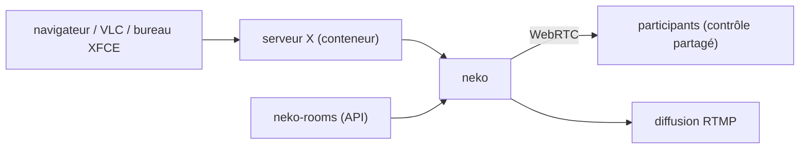

# m1k1o/neko

> Bureau ou navigateur Linux diffusé en WebRTC depuis un conteneur, contrôlable à plusieurs.

## Le problème
Partager un navigateur à plusieurs, ou isoler une session de navigation jetable, oblige à choisir
entre le partage d'écran (sans contrôle partagé) et un bureau distant (sans son, ni fluidité).

## Ce que ça fait vraiment
Neko diffuse un bureau conteneurisé via WebRTC, avec audio et contrôle multi-participants. Ce n'est
pas limité à un navigateur : n'importe quel programme Linux (VLC cité en exemple), voire un
environnement de bureau complet (XFCE, KDE). Il peut tourner hors conteneur, sur un serveur X de
l'hôte. Diffusion de session en RTMP (Twitch, YouTube), enregistrement via nginx-rtmp, gestion de
salles par API avec neko-rooms. C'est un fork : le projet d'origine a été archivé.

## Comment c'est branché

## Essayer
Aucune commande n'est documentée dans ce README : il renvoie aux sections Getting Started,
Installation et Examples de `neko.m1k1o.net`.

## Coût et pièges
Gratuit. Le coût réel est le CPU et la bande passante d'un encodage vidéo temps réel par salle.
Le README mentionne une migration depuis la V2, signe d'une rupture de configuration à prévoir.
Aucune licence n'est citée dans le README.

## Ce que ce n'est pas
Pas un client léger générique : la comparaison faite par le README est avec Apache Guacamole et
noVNC, auxquels Neko ajoute vidéo fluide, audio et contrôle à plusieurs — mais il ne parle
aujourd'hui ni RDP ni VNC, présentés comme un futur possible. Pas un anonymiseur : il faut y mettre
Tor et un VPN soi-même.

## Alternatives
- Apache Guacamole / noVNC : la comparaison explicite du README, sans audio ni contrôle partagé.
- hyperbeam, giggl.app, kasm, mightyapp : les équivalents propriétaires nommés.

## Pour toi
Utile comme bac à sable jetable pour du scraping ou de l'automatisation Playwright observable.
