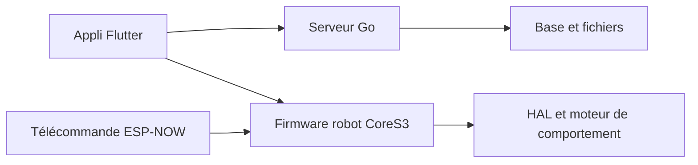

# m5stack/StackChan

> Sources du petit robot de bureau StackChan : firmware ESP32-S3, manette, appli mobile et serveur.

## Le problème
Un robot de bureau à base de CoreS3 a besoin de firmware, d'une appli de pilotage et d'un serveur de contenu, qui vivent d'ordinaire séparés.

## Ce que ça fait vraiment
Quatre morceaux : firmware du robot (écran, caméra, servos, IA agent, OTA, ESP-NOW), firmware de la télécommande (ESP-IDF, LVGL), appli Flutter iOS/Android (appairage, danses, conversation, vidéo) et serveur Go (comptes, appairage, magasin d'applis, WebSocket). Le README indique que le dépôt peut être en retard sur les versions publiées.

## Comment c'est branché

## Essayer
Aucune commande documentée dans le README.

## Coût et pièges
Il faut le robot M5Stack (achat en boutique). Ne pas tourner les axes à la main quand les moteurs sont sous tension. Aucune licence déclarée : réutiliser le code n'est pas clairement permis.

## Ce que ce n'est pas
Pas un projet logiciel autonome : sans le matériel, il n'y a rien à essayer.

## Alternatives
- m5stack/StackChan-BSP : support de carte cité par le README.

## Pour toi
Ignorer : robotique de loisir à matériel dédié, sans licence déclarée, hors du champ data ou MLOps.

