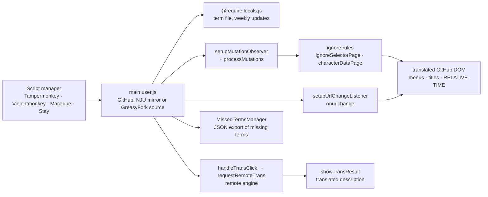

# maboloshi/github-chinese

> **A userscript that translates the GitHub interface into Chinese, in the browser.**

## The problem

GitHub ships no Chinese interface: menus, buttons, page titles and timestamps stay in English.
For non-English speakers this slows down everyday navigation and makes parts of the UI
guesswork rather than reading.

## What it actually does

It replaces GitHub UI elements (menu bar, titles, buttons) with Chinese equivalents, driven by
a continuously updated term file, `locals.js`. On top of that dictionary it applies regular
expression matching, which can be switched on or off from a script-manager menu.

It localises time elements automatically by relying on the Chinese language environment,
including inside the Shadow DOM of `RELATIVE-TIME` tags. It also adds a translate button for
repository descriptions, which sends the text to a remote translation engine (the README names
the iFlytek engine, adopted in v1.8.0 and moved to v2.0 in v1.9.3).

The rest of the work is a set of ignore rules — `ignoreSelectorPage`,
`ignoreMutationSelectorPage`, `characterDataPage` — deciding what not to touch, page by page.
A mutation observer (`setupMutationObserver` + `processMutations`) plus URL-change listening
(`setupUrlChangeListener`, via Tampermonkey's `onurlchange`) keep up with GitHub's dynamic
loading. A missed-term manager (`MissedTermsManager`) records, counts and exports missing
entries as JSON.

## How it is wired



No code-derived diagram ships with this repository: the graph above is reconstructed from the
README alone, using the file and function names its changelog states explicitly.

## Trying it

The README documents no terminal commands: installation happens in the browser. Install
[Tampermonkey](http://tampermonkey.net/), enable "developer mode" and "allow user scripts" in
the Chromium extensions page, then open one of the install sources (GitHub `main.user.js` dev
build, the NJU mirror, or the GreasyFork stable build) and refresh the page.

For local debugging the README documents the project's only "in code" step: download the term
file, then change the require path in the script header.

```js
// original path
// @require https://raw.githubusercontent.com/...

// change to
// @require file:///D:/github-chinese/locals.js
```

You must also enable "allow access to file URLs" in Tampermonkey and, if that is not enough,
switch the config mode to advanced and set local file access to "external (@require and
@resource)".

## Cost and gotchas

- **Free, no API key to supply**, no account to create. The README offers donation QR codes
  (WeChat, Alipay) with no functional counterpart.
- **Depends on a third-party script manager**: Tampermonkey, Violentmonkey, Macaque or Stay
  depending on the browser. On Chrome/Chromium you must enable developer mode, a consequence of
  Manifest V3 (issue #234, cited in the README).
- **Depends on a remote translation engine** for description translation: the description text
  leaves for a third party. The README documents neither quota nor terms of use.
- **Structurally fragile against GitHub's own changes**: the changelog is a long run of repairs
  (jquery-pjax to Turbo, the arrival of React, the header search box disappearing in v1.9.4.1,
  successive fixes through v1.9.4.4). That maintenance cost is permanent.
- **Two update channels**: the dev build (term file refreshed every Friday) and the GreasyFork
  stable build (synced on Mondays). Pick stable if regressions matter.
- **An XSS vulnerability was fixed in v1.9.4** (translation API response inserted via
  `innerHTML`, reported in #692). The script runs on every GitHub page, so its attack surface is
  not zero. Stay updated.

## What it is not

- **Not a content translator.** It translates the interface, not code, not issues, not the
  READMEs of the repositories you browse. Repository descriptions are the only content
  translated, on demand, and by a remote service.
- **Not a store-installable browser extension**: it is a userscript, requiring a third-party
  manager and, on Chromium, developer mode.
- **Not licence-neutral**: GPL-3.0, so copyleft. Reusing the term file or the translation
  machinery inside a closed product is not possible as is.

## Alternatives

- **ChinaGodMan/UserScripts** (catalogue neighbour, and a contributor credited in this README's
  contributor wall): a general-purpose userscript collection. Prefer it when the need goes
  beyond GitHub; prefer github-chinese for deep coverage of GitHub alone.
- **52cik/github-hans**, named in the README as the original project this one derives from.
  Prefer it only for historical reasons: github-chinese is the maintained one today.
- **MUTED64/SearchEngineJumpPlus** (catalogue neighbour): another userscript, but on an
  unrelated subject (jumping between search engines); not a comparable alternative.

## For you

Of no interest for a data / AI / MLOps profile unless Chinese is your working language: this is
interface comfort, not a production tool. One indirect reason to look: the code is a textbook
case of translating a dynamic DOM through a mutation observer and ignore rules, a pattern that
transfers to any UI-rewriting script.
