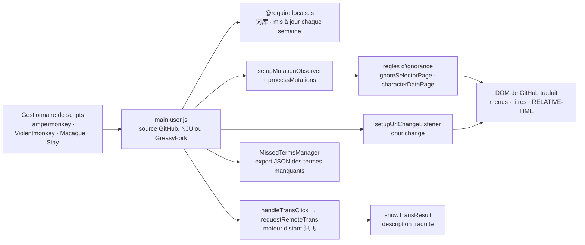

# maboloshi/github-chinese

> **Un script utilisateur qui traduit l'interface de GitHub en chinois dans le navigateur.**

## Le problème

L'interface de GitHub n'existe pas en chinois : menus, boutons, titres et dates restent en
anglais, ce qui freine les utilisateurs non anglophones et rend la navigation quotidienne
plus lente qu'elle ne devrait l'être.

## Ce que ça fait vraiment

Le script remplace les éléments d'interface de GitHub (barre de menus, titres, boutons) par
leur équivalent chinois, à partir d'un fichier de vocabulaire `locals.js` mis à jour en
continu. Il complète ce dictionnaire par une correspondance par expressions régulières,
activable ou désactivable depuis un menu du gestionnaire de scripts.

Il localise automatiquement les éléments de temps en s'appuyant sur l'environnement de langue
chinois, y compris à travers le Shadow DOM des balises `RELATIVE-TIME`. Il ajoute aussi un
bouton de traduction des descriptions de dépôt, qui envoie le texte à un moteur de traduction
distant (le README cite le moteur 讯飞 / iFlytek depuis la v1.8.0, mis à jour en v2.0 en v1.9.3).

Le reste du travail est un jeu de règles d'ignorance : `ignoreSelectorPage`,
`ignoreMutationSelectorPage`, `characterDataPage` décident quoi ne pas toucher, page par page.
Un observateur de mutations (`setupMutationObserver` + `processMutations`) et l'écoute des
changements d'URL (`setupUrlChangeListener`, via `onurlchange` de Tampermonkey) rattrapent le
chargement dynamique de GitHub. Un gestionnaire de termes non traduits (`MissedTermsManager`)
enregistre, compte et exporte en JSON les entrées manquantes.

## Comment c'est branché



Aucun diagramme tiré du code n'accompagne ce dépôt : ce schéma est reconstruit depuis le seul
README, à partir des noms de fichiers et de fonctions que celui-ci cite explicitement dans son
journal des versions.

## Essayer

Le README ne donne aucune commande de terminal : l'installation se fait dans le navigateur.
On installe [Tampermonkey](http://tampermonkey.net/), on active le « mode développeur » et
« autoriser l'exécution de scripts utilisateur » dans la gestion des extensions Chromium, puis
on ouvre l'une des sources d'installation (source GitHub `main.user.js` en version de
développement, miroir NJU, ou GreasyFork en version stable) et on rafraîchit la page.

Pour le débogage local, le README documente la seule manipulation « en code » du projet :
télécharger le fichier de vocabulaire, puis changer le chemin de référence dans l'en-tête du
script.

```js
// 原始路径
// @require https://raw.githubusercontent.com/...

// 修改为
// @require file:///D:/github-chinese/locals.js
```

Il faut en plus activer « autoriser l'accès aux URL de fichiers » dans Tampermonkey et, si cela
ne suffit pas, passer le `mode de configuration` en `avancé` puis régler
`sécurité - autoriser le script à accéder aux fichiers locaux` sur `externe (@require et @resource)`.

## Coût et pièges

- **Gratuit, sans clé d'API à fournir**, sans compte à créer. Le README propose des dons
  (WeChat, Alipay), sans contrepartie fonctionnelle.
- **Dépendance à un gestionnaire de scripts tiers** : Tampermonkey, Violentmonkey, Macaque ou
  Stay selon le navigateur. Sur Chrome/Chromium, il faut activer le mode développeur, à cause du
  passage à Manifest V3 (issue #234 citée dans le README).
- **Dépendance à un moteur de traduction distant** pour la traduction des descriptions : le texte
  de la description part chez un tiers. Le README ne documente ni quota, ni conditions d'usage.
- **Fragilité structurelle face aux évolutions de GitHub** : le journal des versions est une
  longue suite de réparations (passage de jquery-pjax à Turbo, arrivée de React, disparition de la
  barre de recherche en v1.9.4.1, corrections successives en v1.9.4.2 à v1.9.4.4). Ce coût
  d'entretien est permanent.
- **Deux canaux de mise à jour** : version de développement (vocabulaire mis à jour chaque
  vendredi) et version stable via GreasyFork (synchronisée le lundi). Choisir la stable si les
  régressions sont un problème.
- **Une vulnérabilité XSS a été corrigée en v1.9.4** (réponse de l'API de traduction insérée par
  `innerHTML`, signalée par #692) : le script s'exécute sur toutes les pages GitHub, sa surface
  d'attaque n'est pas nulle. Rester à jour.

## Ce que ce n'est pas

- **Ce n'est pas un traducteur de contenu.** Il traduit l'interface, pas le code, pas les issues,
  pas les README des dépôts que vous consultez. Les descriptions de dépôt sont le seul contenu
  traduit, à la demande, et par un service distant.
- **Ce n'est pas une extension de navigateur installable depuis un magasin** : c'est un script
  utilisateur, qui exige un gestionnaire tiers et, sur Chromium, l'activation du mode développeur.
- **Ce n'est pas non plus un projet neutre en licence** : GPL-3.0, donc copyleft. Réutiliser le
  vocabulaire ou la mécanique de traduction dans un produit fermé n'est pas possible tel quel.

## Alternatives

- **ChinaGodMan/UserScripts** (voisin du catalogue, et contributeur cité dans le mur des
  contributeurs de ce README) : une collection généraliste de scripts utilisateur. À préférer si
  le besoin dépasse GitHub ; github-chinese à préférer pour une couverture fine de GitHub seul.
- **52cik/github-hans**, nommé dans le README comme le projet d'origine dont celui-ci est issu.
  À ne préférer que pour raison historique : c'est github-chinese qui est maintenu aujourd'hui.
- **MUTED64/SearchEngineJumpPlus** (voisin du catalogue) : autre script utilisateur, mais sur un
  sujet sans rapport (saut entre moteurs de recherche) ; pas une alternative comparable.

## Pour toi

Sans intérêt pour un profil data / IA / MLOps, sauf si le chinois est votre langue de travail :
c'est du confort d'interface, pas un outil de production. À regarder éventuellement pour une
raison indirecte : le code est un cas d'école de traduction de DOM dynamique par observateur de
mutations et règles d'ignorance, transférable à tout script de réécriture d'interface.
