# mac-cain13/R.swift

> **Code generator that turns an Xcode project's resources into strongly typed Swift symbols.**

## The problem

In an iOS project, images, fonts, colors, nibs, storyboards and localized strings are referred
to by strings: `UIImage(named: "settings-icon")`. The compiler checks nothing, autocompletion
does not help, and a renamed or deleted file only shows up when the app crashes in front of a
user.

## What it actually does

R.swift reads the project's resources on every build and writes a Swift file holding an `R`
struct: `R.image.settingsIcon()`, `R.font.sanFrancisco(size: 42)`,
`R.color.indicatorHighlight()`, `R.nib.customView`, `R.string.localizable.welcomeWithName(...)`.

The resource types listed in the README: images, custom fonts, resource files, colors,
localized strings, storyboards, segues, nibs, reusable cells, project, entitlements and
Info.plist.

An optional `R.validate()` performs at *runtime* the checks compilation cannot make: named
images and colors used in storyboards and nibs exist, view controllers with storyboard
identifiers can be loaded, custom fonts can be loaded.

Generation runs through an SPM build plugin (`RswiftGenerateInternalResources` or
`RswiftGeneratePublicResources`) since version 7, or through a "Run Script" build phase calling
the `rswift generate` binary for CocoaPods and manual installs. The generated file is rebuilt
on every build; the README advises gitignoring `*.generated.swift`.

## How it is wired

No code-derived diagram exists for this repository: the graph below is reconstructed from the
README alone.

```mermaid
graph LR
  A[Xcode project resources<br/>images · fonts · colors<br/>storyboards · nibs · .strings] --> B[SPM build plugin<br/>RswiftGenerateInternalResources<br/>RswiftGeneratePublicResources]
  A --> C[Run Script phase<br/>rswift generate<br/>CocoaPods / manual]
  B --> D[generated R struct]
  C --> E[R.generated.swift<br/>in SRCROOT]
  E --> D
  D --> F[Swift code<br/>R.image.settingsIcon&#40;&#41;]
  D --> G[RswiftLibrary<br/>target dependency]
  G --> H[R.validate&#40;&#41;<br/>runtime validation]
```



## Trying it

The README gives no command-line install for the recommended path: it happens inside Xcode's
UI ("Package Dependencies" tab, then adding the plugin under "Run Build Tool Plug-ins"). The
only documented commands belong to the other paths:

```bash
# CocoaPods: Run Script phase, above Compile Sources
"$PODS_ROOT/R.swift/rswift" generate "$SRCROOT/R.generated.swift"

# Manual install: same phase, binary downloaded into the source root
"$SRCROOT/rswift" generate "$SRCROOT/R.generated.swift"

# CI (Xcode Cloud: in ci_scripts/ci_post_clone.sh)
defaults write com.apple.dt.Xcode IDESkipPackagePluginFingerprintValidatation -bool YES
```

For a `Package.swift` project the README gives the dependency
`.package(url: "https://github.com/mac-cain13/R.swift.git", from: "7.0.0")` plus
`RswiftLibrary` and `.plugin(name: "RswiftGeneratePublicResources")` per target.

## Cost and gotchas

- **Free, MIT licensed**, no API key, no third-party service, no GPU. The real prerequisite is
  outside the catalogue's list: macOS, Xcode and a Swift project.
- **The plugin must be approved by hand** on the first build; the README warns the initial build
  error is there for that. On a non-interactive CI you have to disable plugin fingerprint
  validation, that is, loosen an Xcode security check.
- **Manual Xcode wiring** for CocoaPods and manual installs: build phase ordering, "Output
  Files" to fill in, "Based on dependency analysis" to uncheck. Miss any of these and generation
  silently goes stale.
- **Do not version the generated file** (`*.generated.swift` in `.gitignore`), or every merge
  brings conflicts.
- **Concentrated governance**: the repository belongs to one person and the README names only
  two authors — hence the `mainteneur unique` flag. Old and broad project, narrow decision
  surface.
- **Major migration documented separately** (`Documentation/Migration.md`): moving from 6 to 7
  changes the install method, it is not transparent.

## What it is not

- **Not a feature library**: R.swift adds nothing at runtime beyond `R.validate()`. It moves
  errors from runtime to compile time, nothing more.
- **Not cross-platform**: nothing in the README leaves the Xcode / Swift / Apple ecosystem. No
  server-side, Android or web use.
- **Not free of cost**: the generated file grows with the project and lengthens every build, and
  the `R` struct becomes a dependency cutting across all application code.

## Alternatives

No comparable alternative in the catalogue. The README points to a "Why should I choose R.swift
over alternative X or Y?" question without naming a repository, so no competitor is traceable
here. The suggested neighbours — `SwifterSwift/SwifterSwift` (standard library extensions),
`DaveWoodCom/XCGLogger` (logging), `SDWebImage/SDWebImageSwiftUI` (remote image loading) and
`KeyboardKit/KeyboardKit` (custom keyboards) — are Swift, but none generates resource code: they
share the language, not the problem.

## For you

Ignore it, unless you change jobs: this project touches no part of a data, AI or MLOps pipeline
and only matters if you write iOS or macOS apps. The one transferable lesson is the pattern
itself — generating typed code from an inventory of resources instead of juggling strings —
which also applies to column names or model identifiers, but that does not justify following
the repository.
