# mac-cain13/R.swift

> **Générateur de code qui transforme les ressources d'un projet Xcode en symboles Swift typés.**

## Le problème

Dans un projet iOS, images, polices, couleurs, nibs, storyboards et chaînes localisées se
désignent par des chaînes de caractères : `UIImage(named: "settings-icon")`. Le compilateur ne
vérifie rien, l'autocomplétion n'aide pas, et un fichier renommé ou supprimé ne se manifeste
qu'au moment où l'application plante devant l'utilisateur.

## Ce que ça fait vraiment

R.swift lit les ressources du projet à chaque build et écrit un fichier Swift contenant une
structure `R` : `R.image.settingsIcon()`, `R.font.sanFrancisco(size: 42)`,
`R.color.indicatorHighlight()`, `R.nib.customView`, `R.string.localizable.welcomeWithName(...)`.

Les types couverts, listés par le README : images, polices personnalisées, fichiers de
ressources, couleurs, chaînes localisées, storyboards, segues, nibs, cellules réutilisables,
projet, entitlements et Info.plist.

Un `R.validate()` facultatif fait au *runtime* les vérifications que la compilation ne peut pas
faire : images et couleurs nommées présentes dans les storyboards et les nibs, contrôleurs à
identifiant de storyboard effectivement chargeables, polices personnalisées chargeables.

La génération se déclenche via un plugin de build SPM (`RswiftGenerateInternalResources` ou
`RswiftGeneratePublicResources`) depuis la version 7, ou via une phase « Run Script »
appelant le binaire `rswift generate` pour les installations CocoaPods et manuelles. Le fichier
produit est régénéré à chaque build ; le README conseille d'ignorer `*.generated.swift` en Git.

## Comment c'est branché

Aucun diagramme tiré du code n'existe pour ce dépôt : le schéma ci-dessous est reconstruit
depuis le seul README.

```mermaid
graph LR
  A[ressources du projet Xcode<br/>images · polices · couleurs<br/>storyboards · nibs · .strings] --> B[plugin de build SPM<br/>RswiftGenerateInternalResources<br/>RswiftGeneratePublicResources]
  A --> C[phase Run Script<br/>rswift generate<br/>CocoaPods / manuel]
  B --> D[structure R générée]
  C --> E[R.generated.swift<br/>dans SRCROOT]
  E --> D
  D --> F[code Swift<br/>R.image.settingsIcon&#40;&#41;]
  D --> G[RswiftLibrary<br/>dépendance du target]
  G --> H[R.validate&#40;&#41;<br/>vérification au runtime]
```



## Essayer

Le README ne donne pas de commande d'installation en ligne de commande pour la voie
recommandée : elle se fait dans l'interface d'Xcode (onglet « Package Dependencies », puis
ajout du plugin dans « Run Build Tool Plug-ins »). Les seules commandes documentées sont
celles des autres voies :

```bash
# CocoaPods : phase Run Script, au-dessus de Compile Sources
"$PODS_ROOT/R.swift/rswift" generate "$SRCROOT/R.generated.swift"

# Installation manuelle : même phase, binaire téléchargé dans le source root
"$SRCROOT/rswift" generate "$SRCROOT/R.generated.swift"

# CI (Xcode Cloud : dans ci_scripts/ci_post_clone.sh)
defaults write com.apple.dt.Xcode IDESkipPackagePluginFingerprintValidatation -bool YES
```

Pour un projet piloté par `Package.swift`, le README donne la dépendance
`.package(url: "https://github.com/mac-cain13/R.swift.git", from: "7.0.0")` et le couple
`RswiftLibrary` + `.plugin(name: "RswiftGeneratePublicResources")` par target.

## Coût et pièges

- **Gratuit, licence MIT**, aucune clé d'API, aucun service tiers, aucun GPU. Le vrai prérequis
  est hors de la liste du catalogue : macOS, Xcode et un projet Swift.
- **Le plugin doit être approuvé à la main** au premier build ; le README prévient que l'erreur
  de build initiale sert à cela. Sur un CI sans interaction, il faut désactiver la validation
  d'empreinte des plugins — c'est-à-dire relâcher un contrôle de sécurité d'Xcode.
- **Configuration manuelle dans Xcode** pour CocoaPods et l'installation manuelle : ordre de la
  phase de build, « Output Files » à renseigner, « Based on dependency analysis » à décocher.
  Chacun de ces points oublié donne une génération silencieusement obsolète.
- **Fichier généré à ne pas versionner** (`*.generated.swift` dans `.gitignore`), sinon conflits
  à chaque merge.
- **Gouvernance concentrée** : le dépôt appartient à une personne, et le README ne nomme que
  deux auteurs. D'où l'alerte `mainteneur unique` — le projet est ancien et large, mais la
  surface de décision est étroite.
- **Migration majeure documentée à part** (`Documentation/Migration.md`) : le passage de la 6 à
  la 7 change la méthode d'installation, il n'est pas transparent.

## Ce que ce n'est pas

- **Ce n'est pas une bibliothèque de fonctionnalités** : R.swift n'ajoute rien à l'exécution
  hormis `R.validate()`. Il déplace des erreurs du runtime vers la compilation, rien de plus.
- **Ce n'est pas multiplateforme** : rien dans le README ne sort de l'écosystème Xcode / Swift /
  Apple. Aucun usage côté serveur, Android ou web.
- **Ce n'est pas un système sans coût** : le fichier généré grossit avec le projet et allonge
  chaque build, et la structure `R` devient une dépendance transverse à tout le code applicatif.

## Alternatives

Aucune alternative comparable dans le catalogue. Le README renvoie à une question
« Why should I choose R.swift over alternative X or Y? » sans nommer de dépôt, donc aucun
concurrent n'est traçable ici. Les voisins proposés — `SwifterSwift/SwifterSwift` (extensions
de la bibliothèque standard), `DaveWoodCom/XCGLogger` (journalisation),
`SDWebImage/SDWebImageSwiftUI` (chargement d'images distantes) et `KeyboardKit/KeyboardKit`
(claviers personnalisés) — sont du Swift, mais aucun ne génère de code de ressources : ils
partagent le langage, pas le problème.

## Pour toi

À ignorer, sauf changement de métier : ce projet ne croise en rien une chaîne data, IA ou
MLOps, et n'a d'intérêt que si tu écris une application iOS ou macOS. Le seul enseignement
transférable est le motif lui-même — générer du code typé à partir d'un inventaire de
ressources plutôt que de manipuler des chaînes — qui vaut aussi pour des noms de colonnes ou
des identifiants de modèles, mais cela ne justifie pas de suivre le dépôt.
