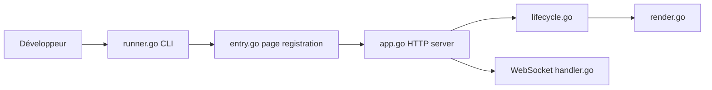

# maddalax/htmgo

> Framework Go pour des sites interactifs côté serveur avec htmx, compilés en un seul binaire.

## Le problème
Construire des sites interactifs sans écrire de JavaScript ni gérer une chaîne front lourde.

## Ce que ça fait vraiment
README très court. Pages et partiels écrits en Go pur, enregistrés automatiquement d'après leur chemin de fichier, rendus en HTML avec des attributs htmx. Rechargement à chaud, Tailwind intégré, extensions htmx maison. Le code ajoute une extension WebSocket et un convertisseur HTML vers Go.

## Comment c'est branché

## Essayer
Aucune commande documentée dans le README ; la documentation est sur htmgo.dev.

## Coût et pièges
Gratuit. Dernier push en septembre 2025.

## Ce que ce n'est pas
Pas un framework SPA ; pas de rendu côté client.

## Alternatives
fastht.ml, cité dans le README comme version Python.

## Pour toi
À ignorer : framework web Go sans lien direct avec data ou IA ; peu de matière dans le README pour juger plus.

