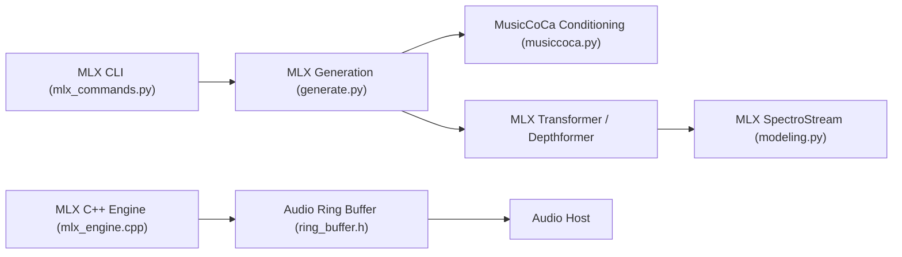

# magenta/magenta-realtime

> Modèle ouvert de génération musicale en temps réel, avec bibliothèque Python et moteur C++ pour Mac.

## Le problème
Générer de la musique en flux, plus vite que la lecture, demande un moteur d'inférence optimisé, pas seulement un modèle.

## Ce que ça fait vraiment
Magenta RealTime 2 génère des tokens audio de façon autorégressive à partir d'un prompt textuel ou de notes MIDI (conditionnement MusicCoCa), décodés par SpectroStream. Deux tailles : `mrt2_small` (230M) et `mrt2_base` (2,4B). Bibliothèque `magenta-rt` (JAX, MLX), moteur C++ `magentart::core` pour Apple Silicon, plugin AUv3 et applications d'exemple.

## Comment c'est branché


## Essayer
```bash
uv venv --python 3.12
source .venv/bin/activate
uv pip install "magenta-rt[mlx]"
mrt models init
mrt models download
mrt mlx generate --prompt "disco funk" --duration 4.0 --model=mrt2_base
```

## Coût et pièges
Temps réel : Apple Silicon requis ; `mrt2_base` exige un chip Pro/Max. Hors temps réel : Mac Apple Silicon ou GPU NVIDIA via la bibliothèque Python.

## Ce que ce n'est pas
Pas un service de streaming grand public. Le fine-tuning supervisé n'est pas livré (« futures mises à jour »).

## Alternatives
Aucune alternative nommée dans le README.

## Pour toi
À surveiller : intéressant pour l'audio génératif si tu es sur Mac Apple Silicon ; hors sujet pour un pipeline data classique.
