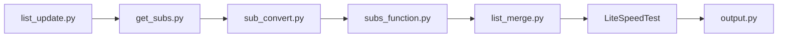

# mahdibland/V2RayAggregator

> Agrégateur de listes d'abonnements proxy publiques, testées en vitesse et republiées en formats Clash et Base64.

## Le problème
Trouver des nœuds proxy (V2Ray, SS, Trojan…) qui fonctionnent demande de fouiller des sources dispersées et de tester chaque nœud à la main.

## Ce que ça fait vraiment
Collecte des abonnements publics et des abonnements « airport », convertit et valide les nœuds, les passe au test de vitesse (LiteSpeedTest) puis publie des sorties mixtes, Base64 et Clash. Les branches « publique » et « airport » sont séparées. Le début du README (installation, usage) n'a pas pu être lu : seule la fin (tableau de clients compatibles) l'a été.

## Comment c'est branché

## Essayer
Aucune commande lue dans la partie disponible du README. Non documenté ici.

## Coût et pièges
Gratuit, mais dépend de sources tierces non maîtrisées. Les nœuds publics sont de confiance nulle : le trafic y transite en clair pour l'opérateur.

## Ce que ce n'est pas
Pas un VPN ni un service garanti. Aucune garantie de disponibilité ni de sécurité des nœuds. Fiche partielle : README lu seulement en fin de fichier.

## Alternatives
Les clients listés dans le README (V2rayNG, SagerNet, CFA) consomment ces listes mais ne les produisent pas.

## Pour toi
Sans rapport avec un travail data/IA/MLOps, et fiche établie sur un README partiel : ignorer.

