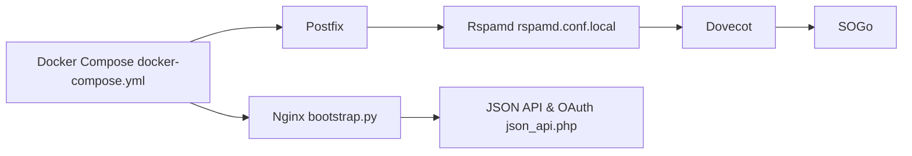

# mailcow/mailcow-dockerized

> Pile de serveur mail auto-hébergée, livrée en services Docker Compose.

## Le problème
Non documenté dans le README (liens communauté et mentions légales seulement).

## Ce que ça fait vraiment
D'après l'architecture : Postfix (SMTP), Rspamd (anti-spam), ClamAV, Dovecot (IMAP), SOGo (groupware/webmail).
MySQL, Redis, Unbound (DNS), ACME (certificats), netfilter, Nginx + PHP pour l'administration et une API JSON.
Watchdog, sauvegarde, hooks d'extension ; scripts `generate_config.sh` et `update.sh`.

## Comment c'est branché

## Essayer
Aucune commande documentée dans le README.

## Coût et pièges
Gratuit ; opérer un serveur mail (DNS, réputation, sécurité) reste exigeant.

## Ce que ce n'est pas
Pas un service mail hébergé. « mailcow » est une marque déposée de The Infrastructure Company GmbH.

## Alternatives
Aucune alternative nommée dans le README.

## Pour toi
À ignorer : infrastructure mail, sans lien avec la data ou le ML.
