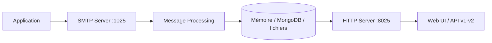

# mailhog/MailHog

> Serveur SMTP de test avec interface web, pour voir les courriels sortants d'une application en développement.

## Le problème
Tester l'envoi de courriels sans risquer d'écrire à de vrais destinataires est difficile avec un vrai serveur.

## Ce que ça fait vraiment
Un exécutable Go qui reçoit du SMTP (port 1025 par défaut), garde les messages en mémoire (ou MongoDB, ou fichiers) et les montre dans une interface web (port 8025) avec mises à jour en temps réel. API HTTP v1 et v2, authentification basique, libération de messages vers un vrai SMTP, remplaçant de `sendmail` (`mhsendmail`) et « Jim », un singe du chaos pour simuler des pannes d'envoi.

## Comment c'est branché


## Essayer
```bash
brew update && brew install mailhog
mailhog
go install github.com/mailhog/MailHog@latest
```

## Coût et pièges
Stockage en mémoire par défaut : tout disparaît à l'arrêt. Dernier push en février 2024 ; 256 issues ouvertes.

## Ce que ce n'est pas
Ce n'est pas un serveur de messagerie de production. Ce n'est pas un outil d'emailing.

## Alternatives
MailCatcher : le README dit s'en inspirer et être plus simple à installer.

## Pour toi
À surveiller : pratique pour tester les notifications d'un pipeline, mais sans mise à jour depuis plus d'un an.

