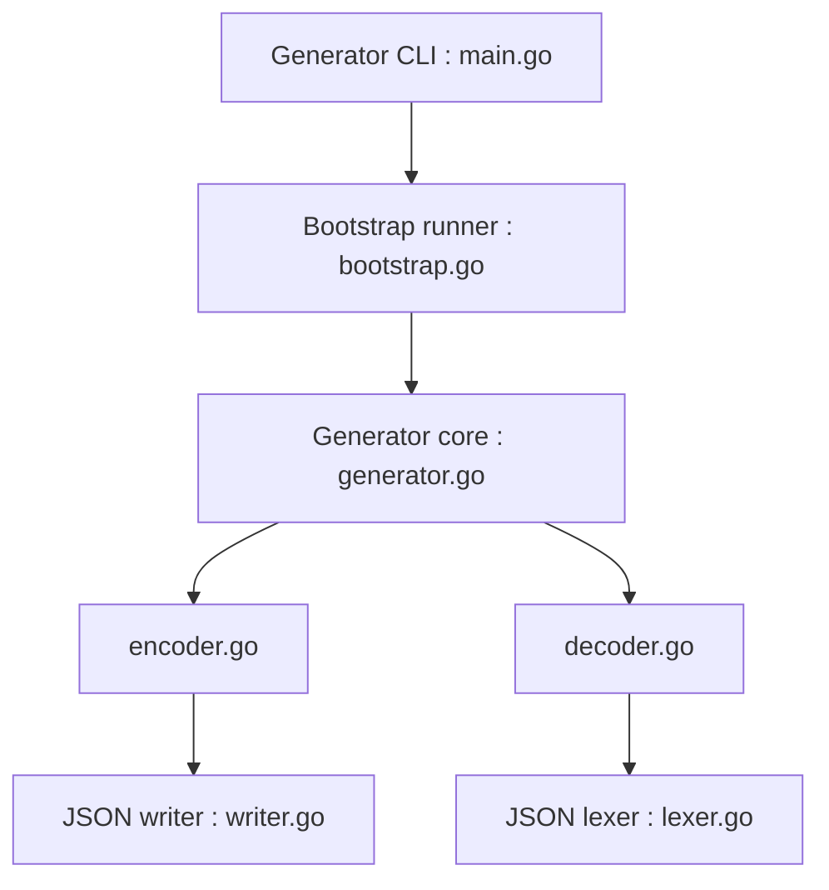

# mailru/easyjson

> Générateur de code Go pour sérialiser des structs en JSON sans réflexion, destiné aux services Go sensibles aux performances.

## Le problème
`encoding/json` repose sur la réflexion et coûte du temps et des allocations sur de gros volumes.

## Ce que ça fait vraiment
Une CLI lit vos structs Go, lance un générateur et écrit un fichier `_easyjson.go` avec des marshalers et unmarshalers. Le runtime fournit lexer, writer, pool de buffers et wrappers optionnels. Le README annonce 4 à 6 fois plus vite que la stdlib selon ses propres benchmarks, datés de 2016.

## Comment c'est branché


## Essayer
```bash
go get github.com/mailru/easyjson && go install github.com/mailru/easyjson/...@latest
easyjson -all <file>.go
```

## Coût et pièges
Gratuit. Nécessite un environnement Go complet. Utilise `unsafe` par défaut (désactivable avec le tag `easyjson_nounsafe`). Clés sensibles à la casse, pas de validation complète, pas de streaming.

## Ce que ce n'est pas
Pas un remplaçant transparent de `encoding/json` : le README dit lui-même qu'il manque des fonctions. Ne fonctionne pas sur les fichiers `package main`.

## Alternatives
- encoding/json : la stdlib, sans étape de génération.
- ffjson : même approche, jugé plus lent et moins stable en concurrence par le README.

## Pour toi
À surveiller : utile seulement si tu as un service Go où le JSON est mesuré comme goulot ; sinon la génération de code n'en vaut pas le coût.

