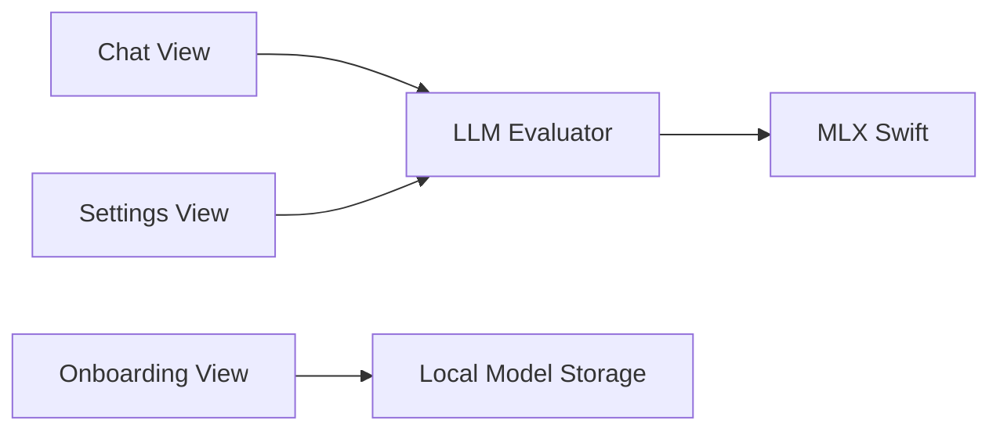

# mainframecomputer/fullmoon-ios

> Application iOS, iPadOS et macOS de chat avec des LLM locaux sur puces Apple.

## Le problème
Discuter avec un modèle de langage sans envoyer ses conversations dans le cloud.

## Ce que ça fait vraiment
README de deux phrases. D'après le code : une app SwiftUI avec vues de chat, d'onboarding (vérification de compatibilité de l'appareil, installation et téléchargement de modèle) et de réglages. Un `LLMEvaluator` exécute les modèles via MLX Swift ; l'historique reste local. Le diagramme cite Llama 3.2 1B et 3B et DeepSeek-R1.

## Comment c'est branché

## Essayer
Aucune commande documentée dans le README.

## Coût et pièges
Gratuit ; matériel Apple silicon et espace disque pour les modèles. Dernier push en mai 2025.

## Ce que ce n'est pas
Pas un service de chat en ligne. Le README ne détaille ni installation ni modèles supportés.

## Alternatives
Aucune alternative nommée dans le README.

## Pour toi
À surveiller : exemple utile d'une app MLX Swift pour l'inférence locale, mais inactive depuis plus d'un an et très peu documentée.

