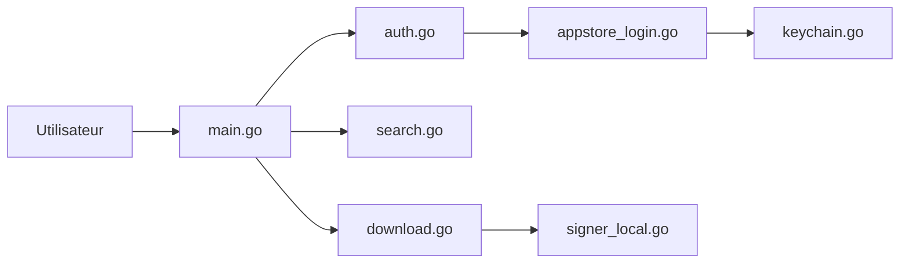

# majd/ipatool

> Outil en ligne de commande pour chercher et télécharger des apps de l'App Store en .ipa ou .pkg.

## Le problème
Récupérer le paquet d'une application Apple, ou une ancienne version, demande de passer par l'App Store officiel.

## Ce que ça fait vraiment
Authentifie un compte Apple, cherche des apps (iOS, iPadOS, tvOS, visionOS, macOS), liste les achats et les versions, obtient une licence et télécharge le paquet. Le code expose aussi des outils MCP, et un module de signature émulé (SAP) sert aux téléchargements. Les identifiants sont stockés dans le trousseau.

## Comment c'est branché


## Essayer
```bash
brew install ipatool
ipatool --help
go build -o ipatool
```

## Coût et pièges
Gratuit, mais exige un compte Apple configuré pour l'App Store. Utiliser `--non-interactive` en automatisation.

## Ce que ce n'est pas
Ne contourne pas les achats : il faut posséder ou obtenir la licence. Dépend des serveurs Apple.

## Alternatives
- Aucune alternative nommée dans le README.

## Pour toi
À ignorer : outil de distribution d'apps iOS, sans usage dans un flux data/IA ; les conditions d'usage Apple sont à lire.

