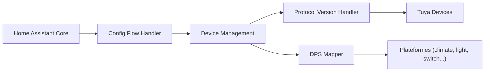

# make-all/tuya-local

> Intégration Home Assistant qui pilote en local les appareils Tuya, sans passer par leur cloud.

## Le problème
Les appareils Tuya passent par le cloud du fabricant : latence, dépendance et fonctions parfois non exposées.

## Ce que ça fait vraiment
Elle se connecte en WiFi aux appareils (ou via une passerelle) avec leur identifiant et leur clé locale, protocoles 3.1 à 3.5. Plus de 1000 modèles sont décrits par des fichiers de configuration. Une configuration assistée par le cloud Tuya récupère les clés. Elle gère aussi blasters IR/RF, serrures et distributeurs de croquettes.

## Comment c'est branché

## Essayer
Installation via HACS (dépôt personnalisé), puis Paramètres → Appareils et services → Ajouter une intégration. Aucune commande shell dans le README.

## Coût et pièges
Gratuit, mais Home Assistant est requis. Beaucoup d'appareils n'acceptent qu'une seule connexion locale ; envoyer trop de commandes peut les faire redémarrer.

## Ce que ce n'est pas
Pas une mesure de sécurité : les appareils continuent d'envoyer leur état au cloud Tuya. La configuration assistée demande de s'authentifier au cloud.

## Alternatives
- rospogrigio/localtuya : plus simple à configurer pour un appareil non pris en charge ici.

## Pour toi
À ignorer pour ton métier : c'est de la domotique, utile seulement si tu as Home Assistant à la maison.

