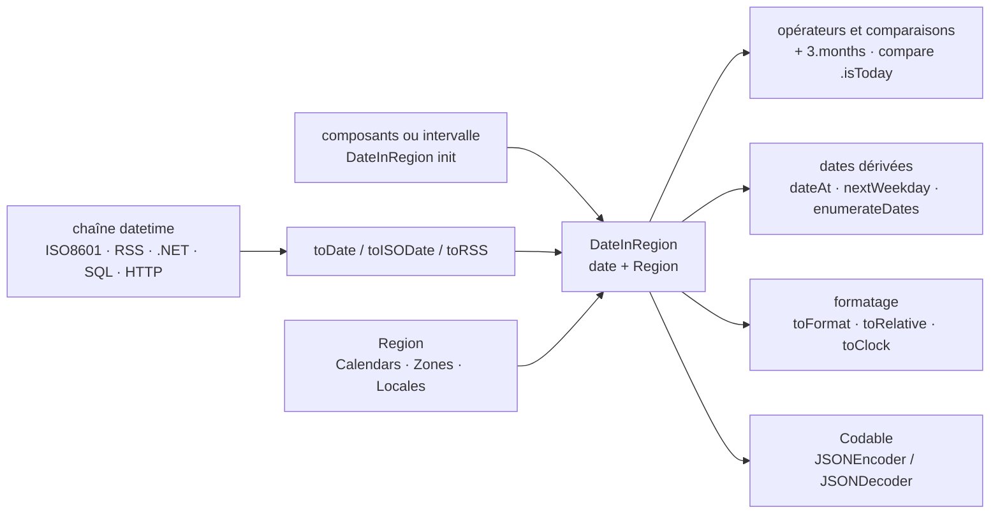

# malcommac/SwiftDate

> **A Swift library to parse, compare, compute and display dates with time zone, calendar and locale.**

## The problem

Handling a date in Swift means coordinating `DateFormatter`, `Calendar`, `DateComponents` and
`TimeZone` by hand for every operation: recognising an ISO8601 or RSS string, adding three
months, checking whether two dates fall in the same week, showing "5 minutes ago" in the
user's language. The resulting code is long, repeated from project to project, and tends to
break exactly where nobody tests: a different time zone, a non-Gregorian calendar, a locale
other than the developer's own.

## What it actually does

SwiftDate adds an expression layer on top of those system types. It recognises about fifteen
datetime formats automatically (ISO8601 and its variants, RSS and Alt RSS, .NET, SQL, HTTP)
through `toDate()`, `toISODate()`, `toRSS()`, and accepts a custom format string.

It introduces a `DateInRegion` type that carries a `Region` with it — calendar, time zone,
locale — so that every component read (`date.year`, `date.monthNameDefault`,
`date.weekdayNameShort`) returns the value expressed in that region, and `convertTo(region:)`
moves a date from one zone to another.

It defines arithmetic operators over time units (`date + 3.months - 2.days`,
`date1 + [.year: 1, .month: 2]`) and more than thirty named comparisons
(`date.compare(.isToday)`, `.isNextWeek`, `isAfterDate(_:orEqual:granularity:)`), plus derived
date generation via `dateAt()` (`.startOfMonth`, `.nextWeekday(.friday)`,
`dateRoundedAt(.toMins(10))`, `dateTruncated(at:)`), enumeration of dates over a range, and
random date generation.

On the display side: `toFormat(_:locale:)`, formatting a `TimeInterval` as a countdown
(`toClock()`) or by components, and a relative formatter announced for 120+ languages with two
styles (`.default`, `.twitter`) and nine flavours, overridable with your own translations.
`DateInRegion` and `Region` conform to `Codable`. Time periods are taken from Matthew York's
DateTools module.

## How it is wired



No code-derived diagram exists for this repository: the graph above is rebuilt from the README
alone, which names no source file. The hub is `DateInRegion`, which carries its `Region`
everywhere — that is why extracted components already come out in the right zone and language,
with no formatter to configure at each call site.

## Trying it

The README contains **no installation command**: it defers the procedure, the requirements and
the license to `Documentation/0.Informations.md`, the full documentation to
`Documentation/Index.md`, and offers an interactive playground under
`Playgrounds/SwiftDate.playground`. It mentions a CocoaPods distribution (the `SwiftDate` pod)
without giving the `Podfile` line.

What can be copied is the usage:

```swift
// All default datetime formats (15+) are recognized automatically
let _ = "2010-05-20 15:30:00".toDate()
// All ISO8601 variants are supported too with timezone parsing!
let _ = "2017-09-17T11:59:29+02:00".toISODate()

// Math operations support time units
let _ = ("2010-05-20 15:30:00".toDate() + 3.months - 2.days)

// All dates includes timezone, calendar and locales!
let rome = Region(calendar: Calendars.gregorian, zone: Zones.europeRome, locale: Locales.italian)
let date1 = DateInRegion("2010-01-01 00:00:00", region: rome)!

// Twitter Style
let _ = (Date() - 3.minutes).toRelative(style: RelativeFormatter.twitterStyle(), locale: Locales.english) // "3m"
```

## Cost and pitfalls

- **Free, MIT licensed** according to the catalogue entry; nothing to pay, no account, no third
  party service, no key.
- **The real prerequisite is the Swift toolchain**, which the README never spells out: Swift
  versions, platforms and package manager are all deferred to
  `Documentation/0.Informations.md`, outside the README. The only dated marker is "Swift 4's
  Codable Support" and an acknowledged API break between 4 and 5, with a dedicated migration
  document (`Documentation/10.Upgrading_SwiftDate4.md`).
- **Transitive dependency**: time periods rely on Matthew York's DateTools module.
- **Exit cost**: a codebase using `DateInRegion` and unit operators throughout does not go back
  to plain `Foundation` without a rewrite. This library seeps into your signatures.
- **Single maintainer**: a personal repository with no organisation or foundation behind it,
  hence the warning kept despite the 7,694 stars and the 3 million CocoaPods downloads claimed.

## What it is not

- **Not a `Foundation` replacement**: SwiftDate builds on the system's `Calendar`, `TimeZone`
  and formatters; it changes the ergonomics, not the engine. Calendar and time zone quirks
  remain those of the platform.
- **Not cross-language**: this is Swift, for Apple platforms and server-side Swift (the README
  cites Vapor and Kitura). Nothing to reuse from Python, JavaScript or the command line.
- **Not a scheduling or recurrence library**: it computes, compares and displays dates; it
  triggers nothing, and handles neither periodic jobs nor RRULE-style recurrence rules, which
  are undocumented here.
- **"140+ languages" and "120+ languages" are about display** — relative formatting and
  component names — not about parsing natural-language strings.

## Alternatives

The catalogue line offers no allowed neighbours (the column is empty), so there is nothing to
rule out on that side. The only repository named in the README is **MatthewYork/DateTools**,
and it is not really a competitor: SwiftDate embeds its module for time periods. You would pick
it alone only if you wanted time intervals and nothing else, without the parsing, region and
relative-formatting layers that make up the rest of SwiftDate.

## For you

Outside the data / AI / MLOps scope: nothing to do with pipelines, training or model serving,
and the language rules out any reuse on the Python side. Worth remembering only if an iOS app
or a Swift service enters the picture — it is then the established reference for anything
involving time zones and localised date display. Otherwise, move on.
