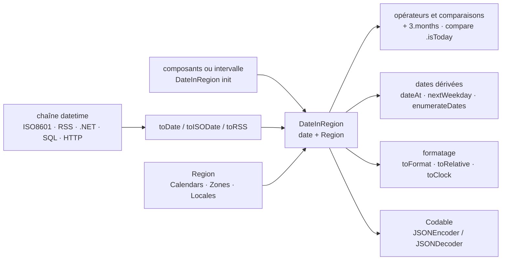

# malcommac/SwiftDate

> **Bibliothèque Swift pour analyser, comparer, calculer et afficher des dates avec fuseau, calendrier et langue.**

## Le problème

Manipuler une date en Swift passe par `DateFormatter`, `Calendar`, `DateComponents` et
`TimeZone`, quatre objets à accorder à la main pour chaque opération : reconnaître une chaîne
ISO8601 ou RSS, ajouter trois mois, savoir si deux dates tombent la même semaine, afficher
« il y a 5 minutes » dans la langue de l'utilisateur. Le code qui en résulte est long, répété
d'un projet à l'autre, et se trompe surtout aux endroits où l'on ne teste pas : changement de
fuseau, calendrier non grégorien, locale différente de celle du développeur.

## Ce que ça fait vraiment

SwiftDate ajoute une couche d'expression au-dessus de ces types du système. Elle reconnaît
automatiquement une quinzaine de formats datetime (ISO8601 et ses variantes, RSS et Alt RSS,
.NET, SQL, HTTP) via `toDate()`, `toISODate()`, `toRSS()`, et accepte un format fourni.

Elle introduit un type `DateInRegion` qui porte avec lui une `Region` — calendrier, fuseau,
locale — de sorte que toute extraction de composant (`date.year`, `date.monthNameDefault`,
`date.weekdayNameShort`) renvoie la valeur exprimée dans cette région, et que
`convertTo(region:)` fait passer une date d'un fuseau à l'autre.

Elle définit des opérateurs arithmétiques sur des unités de temps (`date + 3.months - 2.days`,
`date1 + [.year: 1, .month: 2]`) et plus de trente comparaisons nommées
(`date.compare(.isToday)`, `.isNextWeek`, `isAfterDate(_:orEqual:granularity:)`), ainsi que la
génération de dates dérivées via `dateAt()` (`.startOfMonth`, `.nextWeekday(.friday)`,
`dateRoundedAt(.toMins(10))`, `dateTruncated(at:)`), l'énumération de dates sur un intervalle,
et la génération de dates aléatoires.

Côté affichage : `toFormat(_:locale:)`, formatage d'un `TimeInterval` en compte à rebours
(`toClock()`) ou par composants, et un formateur relatif annoncé pour 120+ langues avec deux
styles (`.default`, `.twitter`) et neuf variantes, surchargeables par ses propres traductions.
`DateInRegion` et `Region` se conforment à `Codable`. Les « time periods » sont repris du
module DateTools de Matthew York.

## Comment c'est branché



Aucun diagramme tiré du code n'existe pour ce dépôt : ce schéma est reconstruit depuis le seul
README, qui ne nomme aucun fichier source. Le point central est `DateInRegion`, qui transporte
sa `Region` partout — c'est ce qui explique que les composants extraits soient déjà dans le bon
fuseau et la bonne langue, sans formateur à configurer à chaque appel.

## Essayer

Le README ne contient **aucune commande d'installation** : il renvoie la procédure, les
prérequis et la licence à `Documentation/0.Informations.md`, la documentation complète à
`Documentation/Index.md`, et propose un playground interactif dans
`Playgrounds/SwiftDate.playground`. Il mentionne une distribution CocoaPods (pod `SwiftDate`),
sans donner la ligne de `Podfile`.

Ce qui est recopiable, ce sont les usages :

```swift
// All default datetime formats (15+) are recognized automatically
let _ = "2010-05-20 15:30:00".toDate()
// All ISO8601 variants are supported too with timezone parsing!
let _ = "2017-09-17T11:59:29+02:00".toISODate()

// Math operations support time units
let _ = ("2010-05-20 15:30:00".toDate() + 3.months - 2.days)

// All dates includes timezone, calendar and locales!
let rome = Region(calendar: Calendars.gregorian, zone: Zones.europeRome, locale: Locales.italian)
let date1 = DateInRegion("2010-01-01 00:00:00", region: rome)!

// Twitter Style
let _ = (Date() - 3.minutes).toRelative(style: RelativeFormatter.twitterStyle(), locale: Locales.english) // "3m"
```

## Coût et pièges

- **Gratuit, licence MIT** d'après le catalogue ; rien à payer, aucun compte, aucun service
  tiers, aucune clé.
- **Le vrai prérequis est l'écosystème Swift**, que le README n'explicite pas : versions de
  Swift, plateformes et gestionnaire de paquets sont renvoyés à `Documentation/0.Informations.md`,
  hors du README. Le seul repère daté est « Swift 4's Codable Support » et une rupture d'API
  assumée entre la 4 et la 5, à laquelle un document de migration est consacré
  (`Documentation/10.Upgrading_SwiftDate4.md`).
- **Dépendance transitive** : les time periods reposent sur le module DateTools de Matthew York.
- **Coût de sortie** : une base de code qui utilise `DateInRegion` et les opérateurs d'unités
  partout ne revient pas à `Foundation` sans réécriture. C'est une bibliothèque qui s'infiltre
  dans les signatures.
- **Mainteneur unique** : dépôt personnel, sans organisation ni fondation derrière, d'où
  l'alerte conservée malgré les 7 694 étoiles et les 3 millions de téléchargements CocoaPods
  annoncés.

## Ce que ce n'est pas

- **Ce n'est pas un remplacement de `Foundation`** : SwiftDate s'appuie sur `Calendar`,
  `TimeZone` et les formateurs du système ; elle en change l'ergonomie, pas le moteur. Les
  particularités de calendrier ou de fuseau restent celles de la plateforme.
- **Ce n'est pas multi-langage** : c'est du Swift, pour les plateformes Apple et pour Swift côté
  serveur (le README cite Vapor et Kitura). Rien à en tirer depuis Python, JavaScript ou la
  ligne de commande.
- **Ce n'est pas une bibliothèque de planification ni de récurrence** : elle calcule, compare et
  affiche des dates ; elle ne déclenche rien, ne gère ni tâches périodiques ni règles de
  récurrence de type RRULE, non documentées.
- **« 140+ langues » et « 120+ langues » concernent l'affichage** — formatage relatif et noms de
  composants — pas l'analyse de chaînes en langage naturel.

## Alternatives

La ligne de catalogue ne propose aucun voisin autorisé (colonne vide), donc rien à écarter de ce
côté. Le seul dépôt nommé dans le README est **MatthewYork/DateTools**, et ce n'est pas
vraiment un concurrent : SwiftDate en intègre le module pour ses time periods. On le préférerait
seul si l'on ne voulait que les intervalles de temps, sans la couche d'analyse, de région et de
formatage relatif qui fait le reste de SwiftDate.

## Pour toi

Hors périmètre data / IA / MLOps : aucun rapport avec les pipelines, l'entraînement ou le
service de modèles, et le langage ferme la porte à toute réutilisation côté Python. À garder en
tête uniquement si une application iOS ou un service Swift entre dans le paysage — c'est alors la
référence établie pour tout ce qui touche aux fuseaux et à l'affichage localisé de dates. Sinon,
passer son chemin.
