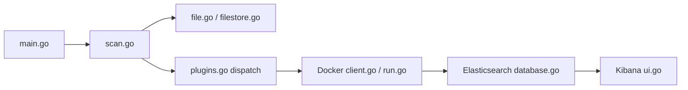

# maliceio/malice

> Cadre d'analyse de malware en Docker, sorte de VirusTotal auto-hébergé, pour chercheurs et équipes sécurité.

## Le problème
Analyser un fichier suspect avec plusieurs moteurs oblige à les installer et à agréger leurs résultats à la main, ou à passer par un service en ligne.

## Ce que ça fait vraiment
- Une CLI Go (`main.go`) : `scan` un fichier, `watch` un dossier, `lookup` un hash, `plugin` pour gérer les plugins, `elk` pour lancer l'interface.
- Le fichier est enregistré (métadonnées, volume partagé) puis envoyé à des plugins d'analyse, chacun dans un conteneur Docker, choisis selon le type MIME.
- Les résultats sont stockés dans Elasticsearch et consultables dans Kibana ; une sortie Markdown est aussi produite.
- Dépôt archivé, dernier push en avril 2023.

## Comment c'est branché


## Essayer
```bash
brew install maliceio/tap/malice
malice scan evil.malware
malice elk
# ou en Docker :
docker run --rm -v /var/run/docker.sock:/var/run/docker.sock malice/engine plugin update --all
```

## Coût et pièges
Environ 16 Go de disque et 4 Go de RAM, Docker obligatoire ; Elasticsearch est gourmand (réglage `vm.max_map_count` sous Linux). Le mode Docker-in-Docker monte le socket Docker : accès large à l'hôte. Clé VirusTotal optionnelle.

## Ce que ce n'est pas
Ce n'est pas un service maintenu : le dépôt est archivé. À manipuler uniquement dans un environnement isolé, car il sert à ouvrir des échantillons de malware réels. La démo publique mentionne des identifiants en clair, sans lien avec un usage réel.

## Alternatives
Aucune alternative nommée dans le README, hormis VirusTotal, dont il se veut la version libre.

## Pour toi
Ignorer : archivé depuis 2023, lourd à héberger et sans lien direct avec un travail data/MLOps ; utile seulement comme exemple d'architecture à plugins conteneurisés.

