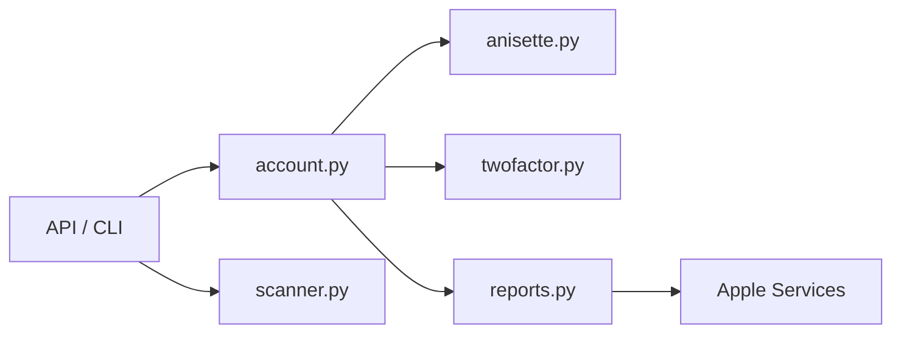

# malmeloo/FindMy.py

> Bibliothèque Python qui interroge le réseau Localiser d'Apple pour retrouver AirTags et appareils, sans Mac.

## Le problème
Le code pour Find My est dispersé dans plusieurs dépôts, ce qui rend l'intégration difficile.

## Ce que ça fait vraiment
Elle se connecte à un compte Apple (SMS ou appareil de confiance en 2FA), récupère et déchiffre les rapports de position, et gère les AirTags officiels et les accessoires OpenHaystack. Elle peut aussi scanner les appareils Find My proches. Les API sont synchrones et asynchrones ; un CLI (`python -m findmy`) est en construction.

## Comment c'est branché


## Essayer
```bash
pip install findmy
python -m findmy
```

## Coût et pièges
Gratuit, mais il faut un compte Apple. Le protocole a été rétro-conçu : Apple peut le changer sans préavis.

## Ce que ce n'est pas
Pas un service officiel d'Apple. Le README ne dit rien sur la conformité aux conditions d'Apple.

## Alternatives
Aucune alternative nommée, hors projets dérivés listés à part.

## Pour toi
À surveiller si tu veux exploiter des données de localisation : utile pour du prototypage, mais fragile car dépendant d'Apple.

