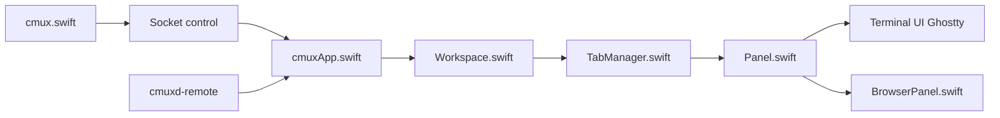

# manaflow-ai/cmux

> Terminal macOS natif pour piloter plusieurs agents de code en parallèle, avec notifications et navigateur intégré.

## Le problème
Avec plusieurs sessions Claude Code ou Codex ouvertes, on ne sait plus quel agent attend une réponse.

## Ce que ça fait vraiment
App Swift/AppKit sur libghostty : onglets verticaux affichant branche git, PR, cwd, ports, dernière notification.
Anneaux de notification sur les panneaux (OSC 9/99/777 ou `cmux notify`), navigateur intégré scriptable.
CLI et socket pour créer workspaces, splits, envoyer des touches ; SSH distant via démon Go.
Restauration de session et reprise des agents via hooks.

## Comment c'est branché


## Essayer
```bash
brew tap manaflow-ai/cmux
brew install --cask cmux
cmux hooks setup
```

## Coût et pièges
Gratuit ; Founder's Edition payante pour l'accès anticipé. macOS uniquement. 5 093 issues ouvertes.

## Ce que ce n'est pas
Pas un orchestrateur d'agents : un terminal à primitives. Ne conserve pas les processus vivants sans `cmux local-tmux`. Non utilisable sous Linux/WSL.

## Alternatives
Aucune alternative nommée dans le README (tmux et Ghostty cités comme comparaison).

## Pour toi
Surveiller : pertinent seulement sur Mac avec beaucoup d'agents en parallèle ; ton poste WSL ne peut pas l'exécuter.
