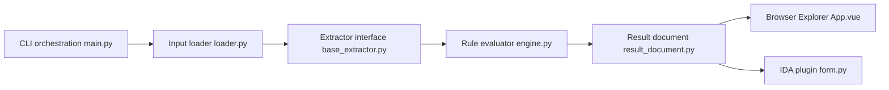

# mandiant/capa

> Outil en ligne de commande qui liste ce qu'un exécutable ou un rapport de sandbox est capable de faire, pour analystes.

## Le problème
Face à un binaire inconnu, retrouver à la main ses comportements (réseau, persistance, chiffrement) en rétro-ingénierie est long et dépend de l'expérience de l'analyste.

## Ce que ça fait vraiment
- Lit un PE, ELF, module .NET, shellcode ou un rapport de sandbox (CAPE, DRAKVUF, VMRay).
- Extrait des caractéristiques (API appelées, chaînes, constantes), puis les compare à des règles YAML du dépôt capa-rules.
- Affiche les capacités détectées, rattachées à ATT&CK et MBC ; `-vv` indique les adresses qui justifient chaque détection.
- Prévient quand l'échantillon semble packé : l'analyse statique est alors peu fiable.

## Comment c'est branché


## Essayer
```bash
capa.exe suspicious.exe
capa.exe suspicious.exe -vv
capa 05be49819139a3fdcdbddbdefd298398779521f3d68daa25275cc77508e42310.json
```

## Coût et pièges
Gratuit ; binaires autonomes à télécharger dans les releases. Les règles sont dans un dépôt séparé. Le backend Ghidra passe par PyGhidra, l'intégration IDA suppose IDA Pro.

## Ce que ce n'est pas
Pas un antivirus ni un verdict : le README parle de ce que le programme « peut » faire. Les échantillons packés ou obfusqués donnent des résultats incomplets. À n'utiliser que sur des fichiers que tu es en droit d'analyser.

## Alternatives
- capa Explorer Web : visualiser les résultats dans le navigateur.
- capa-rules : lire ou écrire les règles de détection.

## Pour toi
À surveiller : utile seulement si tu fais du tri de malware ou de la sécurité des artefacts (modèles, paquets) ; sinon hors de ton cœur de métier, malgré un outil sérieux porté par Mandiant.

