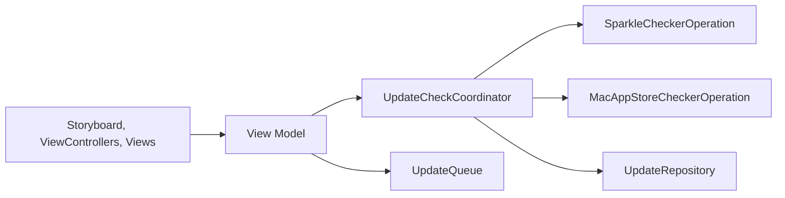

# mangerlahn/Latest

> Petite appli macOS qui vérifie si tes applications sont à jour, App Store et Sparkle.

## Le problème
Savoir quelles applis Mac ont une mise à jour, sans les ouvrir une à une.

## Ce que ça fait vraiment
Un `UpdateCheckCoordinator` lance des vérifications (App Store via CommerceKit, Sparkle, Homebrew) et alimente `UpdateRepository` et son cache. Les mises à jour passent par une `UpdateQueue`. Architecture MVVM, sans serveur : tout tourne en local.

## Comment c'est branché


## Essayer
```bash
brew install --cask latest
```

## Coût et pièges
Gratuit ; don optionnel. Développé sur le temps libre : mises à jour occasionnelles. L'usage de frameworks privés Apple pour l'App Store est décrit dans l'architecture.

## Ce que ce n'est pas
Ne couvre que l'App Store et Sparkle selon le README (Homebrew apparaît dans l'architecture, pas dans le README).

## Alternatives
Aucune alternative nommée dans le README.

## Pour toi
À ignorer : utilitaire de poste Mac, hors périmètre data/IA/MLOps.

