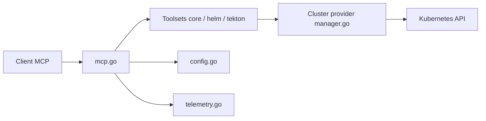

# manusa/kubernetes-mcp-server

> Serveur MCP en Go qui expose Kubernetes et OpenShift à un assistant IA, sans passer par kubectl.

## Le problème
Donner à un agent un accès au cluster passe sinon par des commandes shell fragiles ou des wrappers kubectl/helm.

## Ce que ça fait vraiment
Binaire natif parlant directement à l'API Kubernetes : CRUD sur toute ressource, pods (logs, exec, top, run), événements, nœuds, mise à l'échelle, Helm, et jeux d'outils optionnels (Tekton, Kiali/Istio, KubeVirt, NetObserv, kcp). Multi-cluster via kubeconfig, mode lecture seule, ressources interdites (ex. Secrets), config TOML, OAuth/OIDC en HTTP, OpenTelemetry, masquage des données sensibles dans les logs.

## Comment c'est branché


## Essayer
```bash
npx kubernetes-mcp-server@latest --help
uvx kubernetes-mcp-server@latest --help
kubernetes-mcp-server --config /etc/kubernetes-mcp-server/config.toml
```

## Coût et pièges
Gratuit ; accès à un cluster requis. Les outils peuvent supprimer ou modifier : activer `read_only` et limiter les toolsets, avec un ServiceAccount dédié.

## Ce que ce n'est pas
Pas un assistant : c'est la couche d'outils. Les « 115 issues ouvertes » signalent un projet très sollicité.

## Alternatives
Aucune alternative nommée dans le README (il se distingue de wrappers kubectl/helm).

## Pour toi
À adopter pour brancher un agent sur un cluster, à condition de verrouiller les droits : Apache-2.0, binaire unique et actif.

