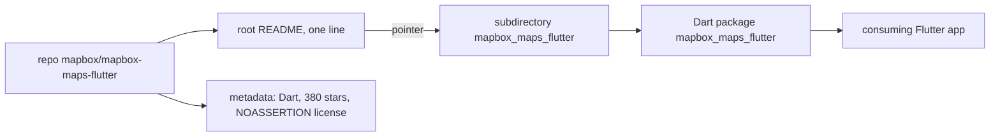

# mapbox/mapbox-maps-flutter

> **A Mapbox Dart repository for Flutter whose README documents nothing at all.**

## The problem

Cannot be stated from the README: it holds a single line, `mapbox_maps_flutter/README.md`, which is
just a pointer to another file. No problem statement, no use case, no audience.

## What it actually does

The README describes no feature whatsoever. The only checkable facts sit outside the text: the
repository belongs to the `mapbox` organisation, its main language is Dart, it has 380 stars, and the
quoted path points to a package named `mapbox_maps_flutter` living in a subdirectory. Everything
else — API surface, supported platforms, native dependencies — is **undocumented here**.

## How it is wired

This diagram says nothing about internals: it only makes explicit the single thing the README
establishes, namely that the real documentation lives in the `mapbox_maps_flutter` subdirectory
rather than at the root. No source file name and no data flow can be inferred.

## Trying it

No command is documented in the README that was read. Nothing is reconstructed here: to install or
run anything you must open `mapbox_maps_flutter/README.md` inside the repository.

## Cost and traps

The README mentions no API key, no quota, no account to create and no third-party service. Two
points still need checking before any use: the declared license is `NOASSERTION`, so it was not
automatically identified, and the empty root documentation forces you to audit the package yourself.
The real cost is therefore **unknown from this source**.

## What it is not

This is not a product assessment: it mostly documents an empty README. Do not conclude the package
is immature or abandoned — nothing here says so, either way. And the repository is not
self-contained: the actual documentation sits elsewhere, one directory down.

## Alternatives

`mapbox/mapbox-maps-ios` appears among the catalogue neighbours: same publisher, same mapping
domain, but it targets native iOS rather than Flutter, so it only replaces this one if you give up
cross-platform. No other alternative is named in the README.

## For you

Little direct value for a data / AI / MLOps profile: this is an application-level mapping SDK, not a
processing or modelling tool. Worth a look only if a Flutter geospatial visualisation project is on
the table — and then by reading the subdirectory README first.
