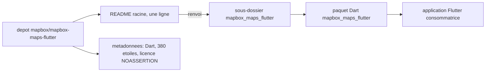

# mapbox/mapbox-maps-flutter

> **Dépôt Dart de Mapbox pour Flutter, sans README exploitable : rien n'y est documenté.**

## Le problème

Impossible à dire depuis le README : celui-ci ne contient qu'une ligne, `mapbox_maps_flutter/README.md`,
c'est-à-dire un renvoi vers un autre fichier. Aucun énoncé de problème, aucun cas d'usage.

## Ce que ça fait vraiment

Le README ne décrit aucune fonctionnalité. Les seuls éléments vérifiables sont extérieurs au texte :
le dépôt appartient à l'organisation `mapbox`, son langage principal est Dart, il compte 380 étoiles,
et le chemin cité indique un paquet nommé `mapbox_maps_flutter` rangé dans un sous-dossier.
Tout le reste — API, plateformes supportées, dépendances natives — est **non documenté ici**.

## Comment c'est branché

Ce schéma ne dit rien du fonctionnement interne : il ne fait qu'expliciter la seule chose que le
README établisse, à savoir que la documentation réelle vit dans le sous-dossier `mapbox_maps_flutter`
et non à la racine. Aucun nom de fichier de code, aucun flux de données n'est déductible.

## Essayer

Aucune commande n'est documentée dans le README lu. Rien n'est reconstruit ici : pour installer ou
lancer quoi que ce soit, il faut aller lire `mapbox_maps_flutter/README.md` dans le dépôt.

## Coût et pièges

Le README ne mentionne ni clé d'API, ni quota, ni compte à créer, ni service tiers. Deux points
restent néanmoins à vérifier avant tout usage : la licence déclarée est `NOASSERTION`, donc non
identifiée automatiquement, et l'absence totale de documentation racine oblige à auditer le paquet
soi-même. Le coût réel est donc **inconnu depuis cette source**.

## Ce que ce n'est pas

Ce n'est pas une fiche d'évaluation du produit : elle documente surtout un README vide de contenu.
Ne pas conclure que le paquet est immature ou abandonné — rien ici ne le dit, dans un sens ni dans
l'autre. Et ce dépôt n'est pas auto-portant : la vraie documentation est ailleurs, en sous-dossier.

## Alternatives

`mapbox/mapbox-maps-ios` figure parmi les voisins du catalogue : même éditeur, même domaine
cartographique, mais cible iOS native plutôt que Flutter — ce n'est donc un remplaçant que si l'on
abandonne le multiplateforme. Aucune autre alternative n'est nommée dans le README.

## Pour toi

Peu d'intérêt direct pour un profil data / IA / MLOps : c'est un SDK cartographique applicatif, pas
un outil de traitement ou de modélisation. À ne regarder que si un projet Flutter de visualisation
géospatiale est au programme — et alors en lisant d'abord le README du sous-dossier.
