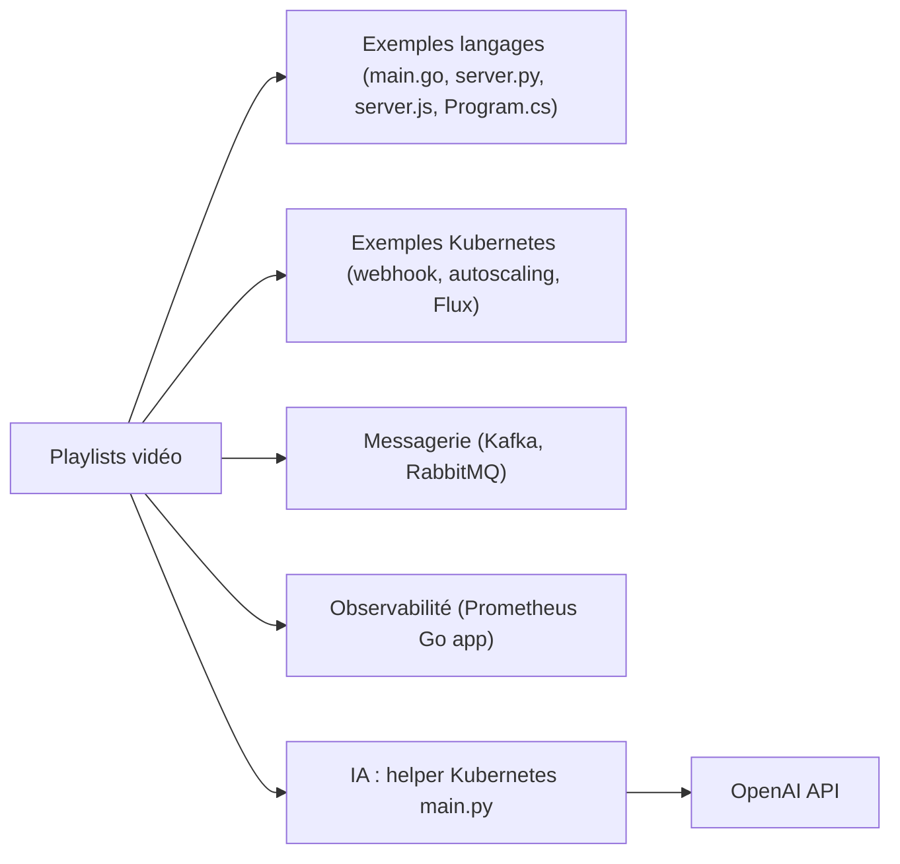

# marcel-dempers/docker-development-youtube-series

> Recueil de code source accompagnant des vidéos DevOps (Docker, Kubernetes, Kafka, observabilité), pour apprenants.

## Le problème
Les tutoriels vidéo sans code associé obligent à tout retaper. Ici, chaque série a son dossier de source exécutable.

## Ce que ça fait vraiment
Ce n'est pas une application mais une boîte à exemples indépendants : petits serveurs HTTP en Go, Python, Node et .NET, webhook d'admission Kubernetes, autoscaling, Flux, producteurs/consommateurs Kafka et RabbitMQ, app Go instrumentée Prometheus, parseurs de logs, un exemple d'API vidéos et un aide-mémoire Kubernetes en Python appelant l'API OpenAI. Le README est un tableau de playlists renvoyant au code. La plupart des exemples n'ont aucun lien entre eux.

## Comment c'est branché


## Essayer
```bash
# Aucune commande unique dans le README : chaque sujet a son dossier source,
# référencé depuis les descriptions des vidéos.
```

## Coût et pièges
Gratuit ; Docker pour la plupart des exemples, clé OpenAI pour l'exemple d'IA. Le code est lié à des vidéos : sans elles, le contexte manque et certaines séries sont anciennes (dépôt créé en 2019).

## Ce que ce n'est pas
Pas une boîte à outils intégrée malgré le titre « Ultimate Engineer Toolbox » : ce sont des démonstrations isolées. Aucune licence déclarée, donc réutilisation du code juridiquement incertaine.

## Alternatives
Non documenté dans le README : aucune alternative nommée.

## Pour toi
À garder en réserve comme support pédagogique Docker/Kubernetes si tu montes en compétence MLOps ; rien à adopter pour un pipeline data ou IA, et l'absence de licence limite la réutilisation.

