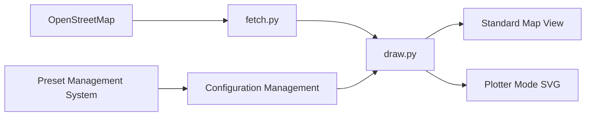

# marceloprates/prettymaps

> Bibliothèque Python pour dessiner des cartes stylisées à partir d'OpenStreetMap.

## Le problème
Produire une belle carte d'un quartier demande de récupérer les couches OSM et de tout styler à la main.

## Ce que ça fait vraiment
`prettymaps.plot('adresse')` récupère les couches OSM via osmnx et trace avec matplotlib/shapely.
Paramètres `layers`, `style`, presets JSON, forme de découpe (`circle`, `radius`).
Renvoie les GeoDataFrames par couche ; mode traceur via vsketch.
Front-end Streamlit et tutoriel marimo.

## Comment c'est branché


## Essayer
```bash
pip install prettymaps
streamlit run app.py
marimo edit notebooks/tutorial.py
```

## Coût et pièges
Gratuit ; dépend des requêtes OSM. Crédit à OpenStreetMap obligatoire sur les figures.

## Ce que ce n'est pas
Pas un outil d'analyse géospatiale ; l'auteur refuse tout usage NFT (sans pouvoir l'imposer légalement).

## Alternatives
Aucune alternative nommée dans le README.

## Pour toi
À ignorer pour le travail ML ; éventuellement sympa pour une illustration géo, sans valeur analytique.
