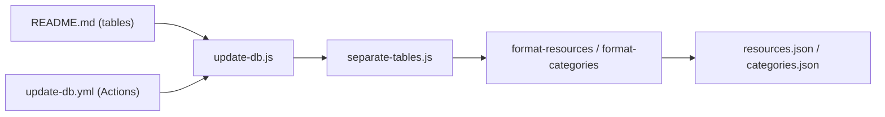

# marcelscruz/public-apis

> Liste triée par catégories d'API publiques et gratuites, avec authentification et CORS, pour développeurs cherchant une source de données.

## Le problème
Trouver une API publique fiable pour un prototype ou un jeu de données demande de fouiller le web.

## Ce que ça fait vraiment
README en tableaux (nom, description, type d'authentification, CORS) répartis en plus de 50 catégories : IA, finance, météo, géocodage, open data, science, santé, etc. Une base JSON dérivée (`db/resources.json`, `db/categories.json`) est régénérée par un script Node (`scripts/db/update-db.js`) et un workflow GitHub Actions. Aucun serveur.

## Comment c'est branché

## Essayer
Le README est un catalogue : aucune commande d'installation n'y figure.

## Coût et pièges
La liste est gratuite, mais beaucoup d'API listées exigent une clé (`apiKey`) ou OAuth, et certaines sont payantes ou limitées. Les entrées sont déclarées par les contributeurs : leur disponibilité n'est pas garantie.

## Ce que ce n'est pas
Ce n'est pas un service ni un client : aucune API n'est appelée par ce dépôt.

## Alternatives
Aucune alternative nommée dans le README.

## Pour toi
À surveiller : pratique comme annuaire de sources (open data, finance, météo, IA) pour alimenter un projet data, mais à recouper à chaque fois.

