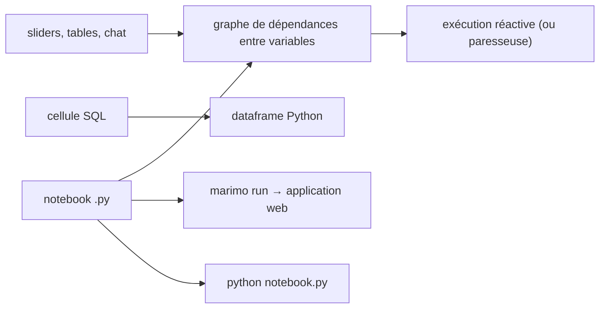

# marimo-team/marimo

> Notebook Python réactif stocké en `.py`, exécutable en script et déployable en application.

## Le problème
Un notebook Jupyter ment : l'ordre d'exécution n'est pas celui de la page, des variables supprimées
survivent en mémoire, et le JSON versionné produit des diffs illisibles.

## Ce que ça fait vraiment
Les cellules sont liées par leurs références de variables, pas par leur position : exécuter une
cellule relance les dépendantes ou les marque périmées, et supprimer une cellule efface ses
variables de la mémoire. Le fichier est du Python pur, donc `python mon_notebook.py` fonctionne,
et `marimo run` le sert en application web avec le code masqué. Cellules SQL intégrées rendant un
dataframe, éléments d'interface liés sans callback, gestion de paquets intégrée avec sandbox venv,
export WASM, `pytest` sur les notebooks, conversion depuis `.ipynb`.

## Comment c'est branché


## Essayer
```bash
pip install marimo
marimo tutorial intro
marimo edit
marimo run your_notebook.py
marimo convert your_notebook.ipynb > your_notebook.py
```

## Coût et pièges
Gratuit. Le piège est la réactivité elle-même : sur un notebook coûteux, une modification peut
relancer toute la chaîne — le README recommande alors de configurer le runtime en mode paresseux,
qui marque les cellules périmées au lieu de les exécuter. `pip install "marimo[recommended]"`
est nécessaire pour les cellules SQL et la complétion IA.

## Ce que ce n'est pas
Pas un Jupyter compatible : c'est un autre modèle d'exécution, avec conversion à sens unique
documentée. Pas un tableau de bord d'entreprise, même si `marimo run` en approche. molab est un
service en nuage distinct, comparé par le README à Google Colab.

## Alternatives
- Jupyter / jupytext / papermill / streamlit / ipywidgets : ce que le README revendique de remplacer.
- Pluto.jl, ObservableHQ, IPyflow : les sources d'inspiration citées.

## Pour toi
Le remplaçant crédible de Jupyter pour tes analyses versionnées — c'est le dépôt le plus directement utile du lot.
