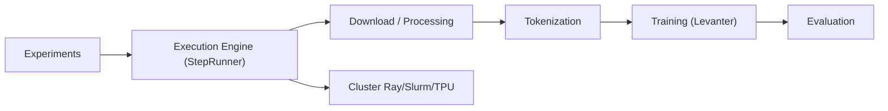

# marin-community/marin

> Programme de recherche et plateforme ouverte pour entraîner des modèles de fondation, avec tout le processus documenté.

## Le problème
Les recettes d'entraînement de LLM (données, mélange, mise à l'échelle) restent opaques et difficiles à reproduire.

## Ce que ça fait vraiment
Expériences définies comme des étapes dépendantes exécutées dans l'ordre topologique, comme un Makefile : téléchargement, transformation, tokenisation, entraînement (Levanter), évaluation, export. Checkpoints et données de la suite « Delphi » publiés ; navigateur de données Flask/React ; exécution sur Ray, Slurm ou TPU.

## Comment c'est branché


## Essayer
```bash
# Extrait : le README fournit un script Python (TinyStories) lancé par
# StepRunner().run([lower(nano_tinystories_model)]) ;
# commandes d'installation dans la documentation liée.
```

## Coût et pièges
Le calcul (GPU/TPU) domine la facture ; suivi Weights & Biases et Hugging Face. Plus de 600 tickets ouverts.

## Ce que ce n'est pas
Pas un outil léger : cadre de recherche à grande échelle, orienté modèles de fondation plus que réglage fin ponctuel.

## Alternatives
- Aucune alternative citée dans le README.

## Pour toi
À surveiller : très instructif sur la reproductibilité de l'entraînement de LLM ; peu pratique sans accès à du calcul important.

