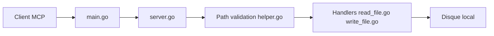

# mark3labs/mcp-filesystem-server

> Serveur MCP en Go donnant à un client IA un accès contrôlé au système de fichiers local.

## Le problème
Un assistant IA ne peut ni lire ni modifier tes fichiers sans un pont sécurisé qui limite où il peut aller.

## Ce que ça fait vraiment
Expose via MCP des outils de lecture, écriture, copie, déplacement, suppression, modification (texte ou regex), listing, arbre, recherche par nom ou contenu et métadonnées. Chaque chemin est validé contre des répertoires autorisés, avec résolution des liens symboliques. Utilisable aussi comme bibliothèque Go.

## Comment c'est branché


## Essayer
```bash
go install github.com/mark3labs/mcp-filesystem-server@latest
mcp-filesystem-server /path/to/allowed/directory
docker run -i --rm ghcr.io/mark3labs/mcp-filesystem-server:latest /path/to/allowed/directory
```

## Coût et pièges
Gratuit. Les outils d'écriture et de suppression sont exposés : ne déclarer que des dossiers sûrs ; avec Docker, monter un volume pour que les changements persistent.

## Ce que ce n'est pas
Pas un sandbox complet : la protection repose sur la validation de chemins. Dernier push fin 2025, 27 issues ouvertes.

## Alternatives
Aucune alternative citée dans le README.

## Pour toi
À surveiller : brique MCP simple et propre pour donner des fichiers à un agent, à restreindre à un dossier de travail dédié.

