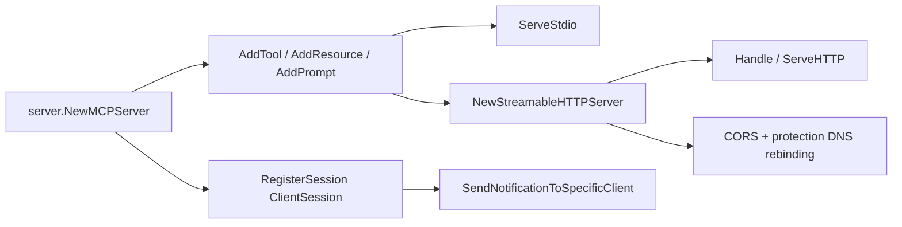

# mark3labs/mcp-go

> SDK Go pour écrire des serveurs Model Context Protocol exposant outils, ressources et prompts.

## Le problème
Implémenter MCP à la main en Go oblige à gérer JSON-RPC, sessions, transports et versions de spec avant d'écrire le premier outil.

## Ce que ça fait vraiment
`server.NewMCPServer` plus `AddTool`, `AddResource`, `AddResourceTemplate`, `AddPrompt` couvrent l'essentiel de la spec.
Implémente MCP 2025-11-25, rétrocompatible 2025-06-18, 2025-03-26 et 2024-11-05.
Outils augmentés par tâche (`AddTaskTool`) pour les traitements longs : le serveur renvoie un ID, le client interroge `tasks/result`.
Transports stdio, SSE et streamable-HTTP ; `StreamableHTTPServer` est un `http.Handler`, avec une entrée `Handle` pour fasthttp ou fiber.

## Comment c'est branché


## Essayer
```bash
go get github.com/mark3labs/mcp-go
```

## Coût et pièges
Gratuit, rien à installer hors Go. Le README prévient que le projet est en développement actif, comme la spec : les fonctionnalités avancées sont incomplètes. Sans `WithMaxConcurrentTasks`, le nombre de tâches concurrentes n'est pas borné.

## Ce que ce n'est pas
Pas une implémentation exhaustive de la spec : le README écrit « Complete* » avec l'astérisque sur « aims ». Pas un client MCP. La protection contre le DNS rebinding s'applique aux connexions loopback : derrière un reverse proxy local il faut réécrire le `Host` ou désactiver explicitement.

## Alternatives
Aucun SDK concurrent nommé dans le README.

## Pour toi
Le choix évident si tu exposes un outil interne en MCP depuis du Go ; regarde les task tools pour les jobs longs.
